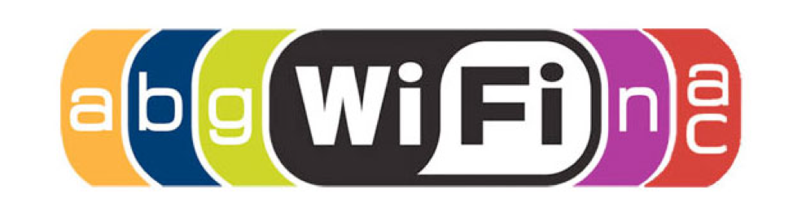
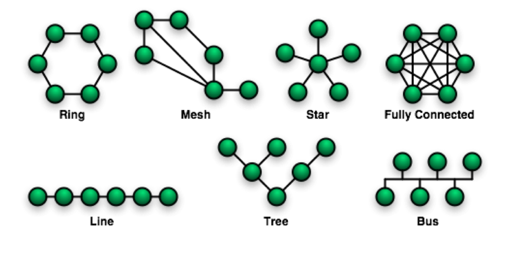
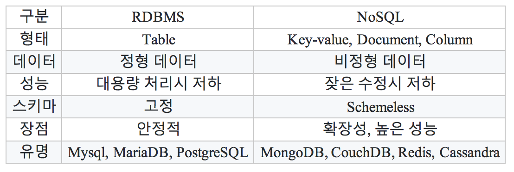

# 네트워크
컴퓨터간 리소스를 공유가능한 통신망
- 컴퓨터사이의 리소스를 공유
- 네트워크로 연결된 다른 컴퓨터에 접근하여 파일을 생성, 수정, 삭제할 수 있음
- 프린터와 스캐너, 팩스 등의 출력장치에 네트워크를 연결하여 여러 컴퓨터가 동시 접근 가능

## 네트워크 필수요소
케이블, 스위치허브, 라우터, 네트워크카드

1:1 간 통신을 위해서는 cross 케이블

## 네트워크 구역
- LAN : 근거리 통신망. 학교 회사 건물 등 가까운 범위
- WAN : 광역 통신망. 국가 대륙간 넓은구역
- MAN : 도시권. LAN과 WAN 사이
- WLAN : 근거리 무선 통신망. IEEE 802.11 표준을 기반

- 802.11 : iEEE에서 개발된 표준 무선통신기술
- WIFI : 와이파이 얼라이언스 상표. 802.11 기술을 기반으로 무선근거리 통신망

### wifi 규격
브라우저가 HTML 문서를 로드한 후 생성할대 객체의 트리로 구조화 되어있다.

오래된(느림) >>>> 최신(빠른)

### 그외..
Lifi : 최단거리. 비콘

## 네트워크 구성 구조

### 국가간 해저케이블
https://www.submarinecablemap.com/

## Ethernet
이'thㅓㄹ'넷.  

전세계의 사무실이나 가정에서 일반적으로 사용되는 유선 LAN에서 가장 많이 활용되는 기술 규격. IEEE 802.3 기반

## OSI 7 레이어
국제표준화기구의 컴퓨터 네트워크 프로토콜 디자인과 통신을 계층으로 나누어 설명한 것

## 패킷 Packet
- 데이터를 한번에 전송할 데이터 단위
- 1492 ~ 1500 bytes(프로토콜에 따라 다름)
- 네트워크에서는 바이트(byte)라는 표현 대신 옥텟(octet)으로 표현

## OSI 7 계층

### 7) Application Layer
- 사용자에게 보이는계층
- 사용자에게 네트워크 자원에 대한 접근을 제공
- 네트워크 활동들에 대한 모든 기본적인 인터페이스를 제공

### 6) Presentation Layer
- 응용 계층으로 부터 전송 받거나 전달되는 데이터의 인코딩과 디코딩
- 안전하게 데이터를 사용하기 위해 몇 가지 암호화와 복호화 형식 보유

### 5) Session Layer
- 컴퓨터의 연결간 연결상태를 확인.
- 모든 통신 장비를 연결하고 관리하며 종료
- 순간적으로 연결이 끊어지는 것을 막고 호스트 사이의 연결을 적절하게 종료시키기 위한 기능과 연결이 단방향인지 양방향인지에 대한 것을 담당

### 4) Transport Layer
- 흐름 제어, 분할, 재조립, 오류 관리
- 지점과 지점 간의 오류가 없음을 보장
- 신뢰성 있는 데이터를 전송할 수 있게 함

### 3) Network Layer
- 물리적인 네트워크 사이의 라우팅을 담당 하며, 라우터가 이 계층에서 동작
- 네트워크 주소(IP)를 관리하고 패킷을 분할해 프로토콜을 식별하는 기능, 오류 탐지

### 2) Datalink Layer
- 물리적인 네트워크 사이의 데이터 전송 담당
- 브리지와 스위치

### 1) Physical Layer
- 네트워크 간 사용되는 물리적인 매개체
- 케이블, 허브, 네트워크어댑터 등 하드웨어적인 물리적인 정의

## OSI 요소
### HTTP
- www상에서 정보를 주고받는 프로토콜
- TCP UDP를 활용
- http메소드 GET POST PUT DELETE

### FTP
- 파일 전송할때 사용
- 오래된 프로토콜이기 때문에 FTPS(FTP-SSL), SFTP(simple FTP), SSH(Secure SHell) 등을 사용

### SMTP
- 메일 전송 프로토콜 
  - 받을때는 IMAP.

### TCP/IP
전송제어 프로토콜, 송수신 호스트(gateway) 패킷교환을 위한 프로토콜

### TCP
근거리 통신망이나 인트라넷, 인터넷에 연결된 컴퓨터에서 실행되는 프로그램 간에 일련의 옥텟(==byte)을 안정적으로, 순서대로, 에러없이 교환할 수 있게 함

- STREAM 
  - 데이터가 열의 형태로 연속적으로 분할
- DATAGRAM 
  - 하나의 패킷이 발신자와 수신자 정보를 모두 담아서 독립적인 패킷

### IPv4 
32비트 43억개 ip

### IPv6
128비트 2^128

### 127.0.0.1 vs 192.168.0.x
- 127.0.0.1 : localhost 컴퓨터가 가지고 있는 무조건 반대신호를 반환하는 대역
- 192.168.0.x : LAN에서 라우터가 할당한 내컴퓨터의 IP address

### DNS
IP주소를 외우기 힘들며, 사람이 판별하기 쉬운 도메인주소를 매핑하는 시스템

### Subnetmask
- 커다란 네트워크를 효율적으로 분배하여 사용하기 위한 방법
- 할당받은 하나의 IP주소를 네트워크 환경에 맞춰 적절히 나누어줌
- 지역마다 분배되어 사용하기 때문에 미리 어느지역일지 특정할수있음.

## UDP
데이터그램을 전송하기 위한 프로토콜.  
정상전송확인X, 빠른 속도, 적은 오버헤드

## intranet vs Internet vs internet
- intranet(인트라넷): internet의 www기술을 활용하여 특정 단체의 내부 정보시스템을 구축하는 것 혹은 그 네트워크
- Internet(International Network): TCP/IP를 활용하여 정보를 주고 받는 통신 네트워크(www)
- internet(internetwork): 패킷을 교환하는 방식으로 기기간의 정보를 주고 받는 방식

## Data
컴퓨터가 처리할 수 있는 문자, 숫자, 소리, 그림 따위의 형태로 된 정보.
Latin "Datum"의 복수형 "Data"에서 유래

## DataBase
체계화된 정보들을 저장하여 운영할 수 있는 공용 데이터들의 묶음

### DBMS(DataBase Management System)
데이터의 모임인 Database로, 저장, 관리 할 수 있는 기능을 제공하는 응용프로그램
Oracle, Mysql, MariaDB, DB2, MS SQL Server 

### DB, 파일시스템 차이
파일을 열기 위해서는 외부프로그램이 필요하지 않고 SQL만으로 사용하는 데이터베이트

### RDBMS vs NoSQL

# URI, URL, URN
URI : 모든정보의 리소스를 가르키는 식별자 https://www.example.com/post/how-to-make-url
URL : 리소스의 위치를 나타낸다. https://www.example.com/post/
URN : 리소스의 이름을 나타낸다. www.example.com/post/how-to-make-url