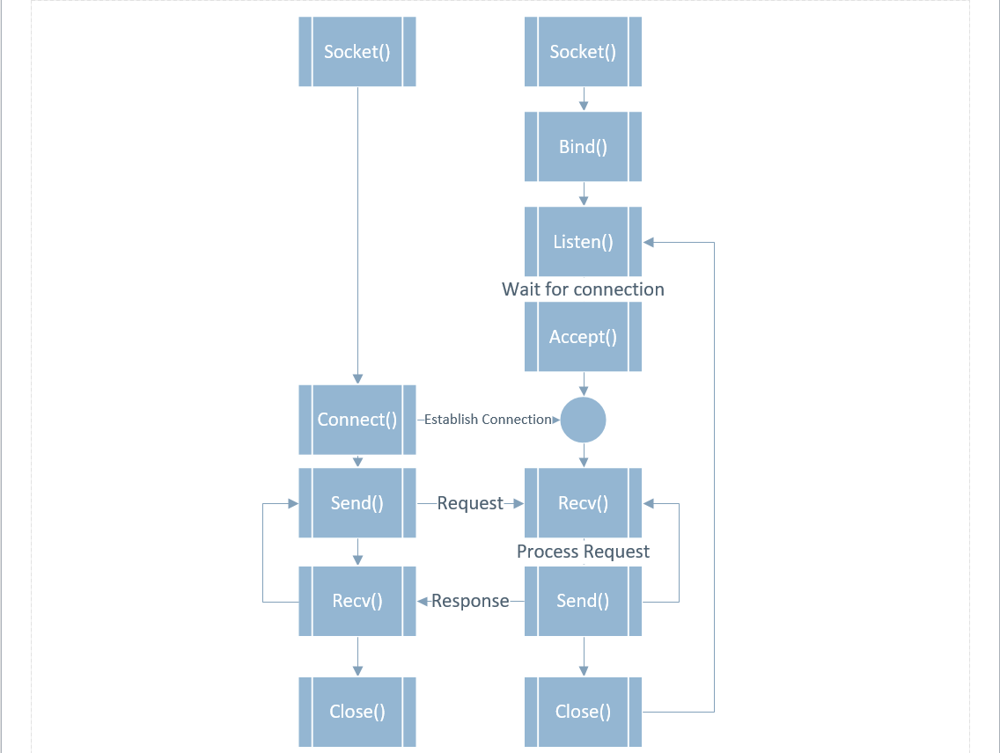

# API
응용프로그램에서 사용할 수 있도록, 운영체제나 프로그래밍 언어가 제공하는 기능을 제어할 수 있게 만든 인터페이스
 
## Web API
웹서버, 웹브라우저를 위한 api
 
## SOAP
XML 파일 포맷을 사용하여 데이터를 주고받는 방법
REST를 사용하기전 부터에 사용하였고,  현재도 rss처럼 사용하고있음
 
## REST API
XML은 문서이기 때문에 문서 전체를 받아, 문서에서 찾아서 사용하지만
REST는 URI로 서버에 요청해서 필요한 부분을 받을수 있다.

HTTP URI + HTTP method를 사용하는것.
 
### json
자바스크립트 객체 를 전달하기 위한 포맷
 
### REST 특징
- 범용성(HTTP가 가능하면 OK. 안드로이드 ios에서도 사용)
- 리소스 중심 API 명세(URI를 읽는 것으로 이해 가능)
- Stateless(클라이언트의 상태를 신경쓰지 않음)
- 스펙없이 http를 사용하면 요청을 처리할수있다.
- 하지만 표준이 없다. 메소드가 4개로 한정적이다.
 
#### HTTP REST CODE
|HTTP||REST|Status Code|
|:--:|:--:|:--:|:--:|
|GET||read|200 OK|
|POST||update|200 OK|
|PUT||create|201 CREATED|
|DELETE||delete|200 OK|

POST
create
201 CREATED
PUT
update
200 OK
DELETE
delete
200 OK
 
#### example
```js
app.get('/users', (req,res)=>{
    res.json(db.users);
});
 
app.get('/users/:id', (req,res)=>{
    let user = db.users.find(user => user.id == req.params.id);
    if (user) {
        res.json(user);
    } else {
        res.status(404).end();
    }
});
 
app.post('/users', ...);
 
app.delete('/users/:id', ...);
```


#### REST설계시 주의할점
- 버전관리 //api.foo.com/v1/bar
- 명사형 사용 //foo.com/user/ 
  - //foo.com/showid/ [x]
- 반응형 //foo.com/m/user/
  - //m.foo.com/user/ [x]
- 언어코드 //foo.com/kr/
  - //kr.foo.com/ [x]
- 기존의 정의된 메소드를 최대한 사용(200, 403, ..)

## Socket
컴퓨터간에 포트를 오픈하여 상호작용하며 통신.

소캣타입이 TCP의 경우 STREAM 방식, UDP의 경우 DGRAM(datagram)



프로그램개발시 소캣통신을 사용하기 위해서는 클라이언트와 서버가 각각 소캣라이브러리를 선언해야하며, 서버측은 소캣연결을 받을수 있도록 선언되어있어야 한다. 

클라이언트쪽에서 서버쪽 정보를 입력하여 연결 명령을 실행하면 서버과 클라이언트간 연결이 성공한다.   
연결을 끊기 전까지 계속저긍로 상호통신을 한다.
 
### WebSocket
- 웹사이트가 사용자와 상호작용하기 위해 만들어진 기술
- W3C가 관리하여 거의 표준기술처럼 여긴다.
- 기존의 소캣은 TCP/IP 기반에 HTTP를 실행한다면, 웹소캣은 브라우저에서 실행한다.
 
### Socket.io
- 브라우저와 상관없이 js로 실시간 통신 지원
- 짧은코드로 소켓통신프로그래밍이 가능하다
