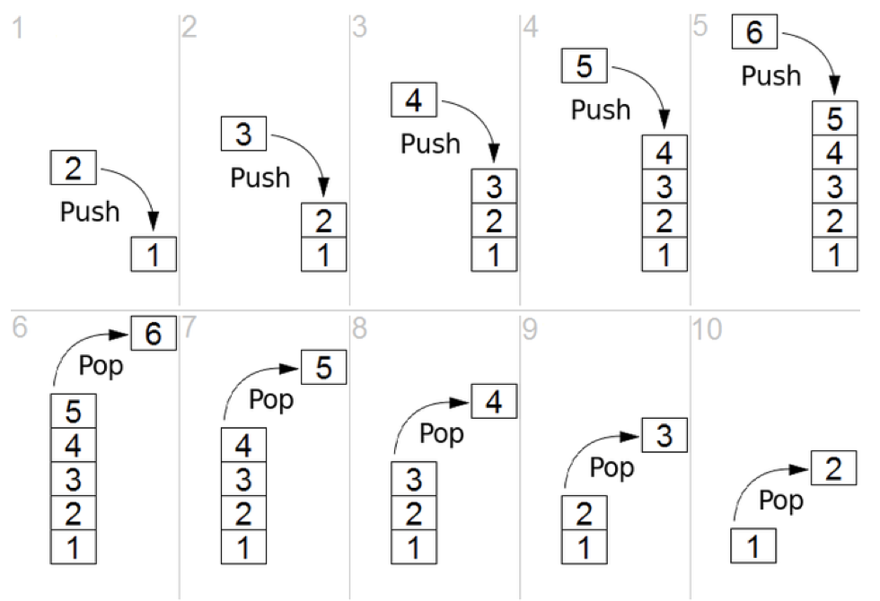
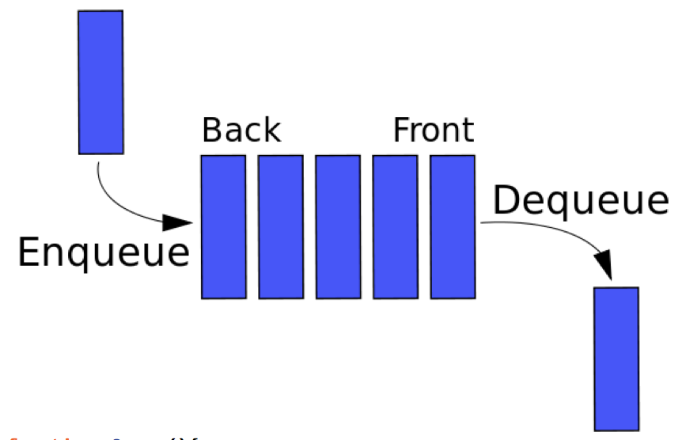

# 자료구조 : 
데이터를 조직하고 사용할때 효율적으로 사용하기 위한 방법론

- 큐(Stack) BFS : 후입선출, 나중에 들어간 것부터 꺼낸다.
- 스택(Queue) DFS : 들어간 순서대로 꺼내는 구조, 뒤에서 넣고, 앞에서 빼는 구조


# 스택 (Stack)
- LIFO(Last In, First Out): 후입선출 구조
- push : 리스트에 요소를 추가합니다.
- pop : 아직 제거되지 않은 가장 최근에 추가 된 요소를 제거합니다.

 

```js 
var Stack = function() {
  constructor();
let items = [];
this.push = function(element) {
    return items.push(element);
  };
this.pop = function() {
    return items.pop();
  };
this.peek = function() {
    return items[items.length - 1];
  };
this.size = function() {
    return items.length;
  };
this.isEmpty = function() {
    return items.length === 0;
  };
this.clear = function() {
    items = [];
  };
this.print = function() {
    console.log(items.toString());
  };
};
// 스택을 사용한 10진수 > 2진수
var convert10to2 = function(val) {
  var stack = new Stack();
  var base = val;
  var result = '';
while(base > 0){
    stack.push(Math.floor(base%2));
    base = Math.floor(base/2);
    //console.log(base, '<< [ base ]');
  }
while(!stack.isEmpty()){
    result += stack.pop().toString();
  }
return result;
};
console.log(convert10to2(10), '<< [ convert10to2(10) ]'); //1010
console.log(convert10to2(31), '<< [ convert10to2(31) ]'); //11111
```
 
 
# 큐(Queue)
- FIFO(First In First Out) : 들어온 순서대로 나간다.
- Enqueue : 요소를 리스트 뒤쪽에 추가한다.
- Dequeue : 앞 리스트 위치의 엔터티 제거
 

 
 
```js
function Queue(){
  var items = [];
this.enqueue = function(element) {
    items.push(element);
  };
this.dequeue = function() {
    return items.shift();
  };
this.stackLike = function(){
    var result = [];
while(!this.isEmpty()){
      result.push(items.pop());
    }
items = result;
  }
this.front = function() {
    return items[0];
  };
this.isEmpty = function(){
    return items.length === 0;
  };
this.clear = function(){
    items = [];
  };
this.size = function(){
    return items.length;
  }
this.print = function(){
    console.log(items.toString());
  }
}
const queue = new Queue();
queue.enqueue(1);
queue.enqueue(2);
queue.enqueue(3);

queue.print(); // 1,2,3
queue.stackLike(); //해당 큐를 스택처럼 변환
queue.print(); // 3,2,1

function QueueAndStack() {
  var inBox = [];
  var outBox = [];
this.enqueue = function(num) {
    inBox.push(num);
  };
this.dequeue = function() {
    if(outBox.length > 0) {
      return outBox.pop();
    }
while(inBox.length > 1) {
      outBox.push(inBox.pop());
    }
return inBox.pop();
  };
};
var qas = new QueueAndStack();
qas.enqueue(2);
qas.enqueue(3);
qas.enqueue(5);
console.log(qas.dequeue(), '<< [ qas.dequeue() ]'); //2
console.log(qas.dequeue(), '<< [ qas.dequeue() ]'); //3
console.log(qas.dequeue(), '<< [ qas.dequeue() ]'); //5
console.log(qas.dequeue(), '<< [ qas.dequeue() ]'); //undefined
```
 
## 큐를 사용한 정렬 알고리즘
```js
function PriorityQueue(){
  var items = [];
function QueueElement(element, priority){
    this.element = element;
    this.priority = priority;
  }
this.enqueue = function(element, priority){
    var queueElement = new QueueElement(element, priority);
if(items.length == 0){
      items.push(queueElement);
    }else{
      var added = false;
      for(var i = 0; i < items.length; i++){
        if(queueElement.priority < items[i].priority){
          items.splice(i, 0, queueElement);
          added = true;
          break;
        }
      }
if(!added){
        items.push(queueElement);
      }
    }
  };
this.dequeue = function(){
    return items.shift();
  };
this.front = function(){
    return items[0];
  };
this.size = function(){
    return items.length;
  };
};
var priorityQueue = new PriorityQueue();
priorityQueue.enqueue("__", 4);
priorityQueue.enqueue("fast", 1);
priorityQueue.enqueue("school", 3);
priorityQueue.enqueue("campus", 2);
console.log(priorityQueue.dequeue(), '<< [ priorityQueue.dequeue() ]'); //fast
console.log(priorityQueue.dequeue(), '<< [ priorityQueue.dequeue() ]'); //campus 
console.log(priorityQueue.dequeue(), '<< [ priorityQueue.dequeue() ]'); //school
console.log(priorityQueue.dequeue(), '<< [ priorityQueue.dequeue() ]'); // __
```
#Gulp
- Task runner
- 귀찮은 루틴작업들을 자동화 시키는 툴
 
https://github.com/downmix/taskRun-Gulp
 
