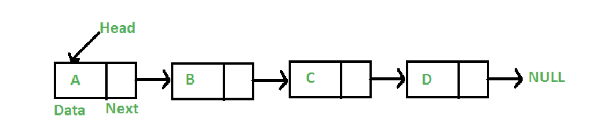
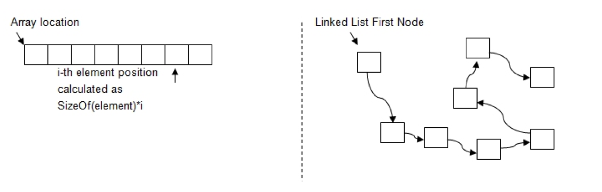
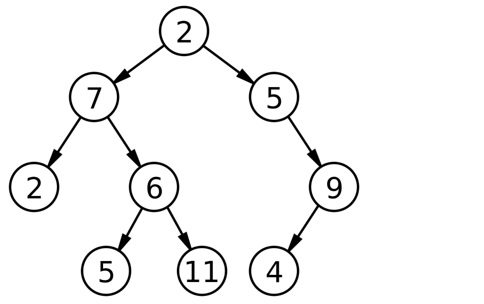

# 링크드 리스트 (Linked List)

- 첫 시작은 Head, 마지막은 NULL
- 아이템 내에 데이터가 있고 다음 아이템의 주소가 있어 연결되는 구조

## Array vs Linked List


| Array  | Linked List |
|---|---|
| 데이터간 규직적인 데이터 주소로 이루어짐 |  규칙적인 데이터 주소를 가지고 있지는 않고 파편화된 데이터 위치를 지정 |
|  사이즈 : 규칙적 | 사이즈 : 제각각(유동적)  |
| insert : 어려움  | insert : 쉬움  |
|  부분삭제 : 여러움 |  부분삭제 : 쉬움 |
|  임의접근(원하는곳에 한번에 접근) : 가능 | random Access : 탐색을 해야 가능  |
|  메모리 여유 : 불필요 | 메모리 여유분 : 필요  |
| 시간복잡도  
access o(1) / search o(n) / insert o(n) / remove o(n) |access o(n) / search o(n) / insert o(1) / remove o(1) |

```js 
/*------------------------------------*/
/* [ 링크리스트 구현 ] */
function linkedList(){
  /*------------------------------------*/
  /* [ Base 선언 ] */
  var Node = function(element){
    this.element = element;
    this.next = null;
  };
var length = 0;
  var head = null;
  
  /*------------------------------------*/
  /* [ 링크 추가 ] */
  this.append = function(element){
    var node = new Node(element), current;
    if(head === null){
      head = node;
    }else{
      current = head;
      while(current.next){
        current = current.next;
      }
      current.next = node;
    }
    length++;
  };
/*------------------------------------*/
  /* [ 원하는 위치의 제거 ] */
  this.removeAt = function(position){
    if(position > -1 && position < length){
      var current = head,
        previous,
        index = 0;
if(position === 0){
        head = current.next;
      }else{
        while(index++ < position){
          previous = current;
          current = current.next;
}
        previous.next = current.next;
      }
length--;
      return current.element;
    }else{
      return null;
    }
  };
/*------------------------------------*/
  /* [ 원하는 위치에 추가 ] */
  this.insert = function(position, element){
    if(position >= 0 && position <= length){
      var current = head,
        previous,
        index = 0,
        node = new Node(element);
      
      if(position === 0){
        node.next = current;
        head = node;
      }else{
        while(index++ < position){
          previous = current;
          current = current.next;
        }
node.next = current;
        previous.next = node;
      }
      length++;
return true;
    }else{
      return false;
    }
  };
/*------------------------------------*/
  /* [ 마지막 링크 제거 ] */
  this.remove = function(element){
    var index = this.indexOf(element);
    return this.removeAt(index);
  };
/*------------------------------------*/
  /* [ 링크 구조 크기 ] */
  this.indexOf = function(element){
    var current = head,
      index = 1;
    
    while(current){
      if(element === current.element){
        return index;
      }
      index++;
      current = current.next;
    }
return -1;
  };
/*------------------------------------*/
  /* [ 링크내 연속 값 제거 ] */
  this.removeDuplicates = function(){
    var current = head;
while(current){
      var current2 = current; //얕은복사
while(current2.next != null ){
        if(current2.element === current2.next.element){
          current2.next = current2.next.next;
          length--;
        }else{
          current2 = current2.next;
        }
      }
      current = current.next;
    }
return current;
  };
this.isEmpty = function(){
    return length === 0;
  };
this.size = function(){
    return length;
  }
this.toString = function(){
    var current = head,
      string = '';
while(current){
      string += current.element;
      current = current.next;
    }
    return string;
  };
this.getHead = function(){
    return head;
  };
}
var linkList = new linkedList();
linkList.append(2);
linkList.append(5);
linkList.append(8);
linkList.append(1);
linkList.append(3);
linkList.append(4);
console.log(linkList.toString(), '<< [ linkList.toString() ]');
linkList.insert(3, '0');
console.log(linkList.toString(), '<< [ linkList.toString() ]');
linkList.remove(3);
console.log(linkList.toString(), '<< [ linkList.toString() ]');
linkList.removeAt(3);
console.log(linkList.toString(), '<< [ linkList.toString() ]');
var linkList2 = new linkedList();
linkList2.append(1);
linkList2.append(2);
linkList2.append(2);
linkList2.append(3);
linkList2.append(3);
// ...

console.log(linkList2.toString(), '<< [ linkList2.toString() ]');
linkList2.removeDuplicates();
console.log(linkList2.toString(), '<< [ linkList2.toString() ]');
console.log(linkList2.size(), '<< [ linkList2.size() ]');
```
 
 
# Tree
구조계층을 가진 자료구조


root: 2  
level: (0단계 ~ 3단계)  
child of 2: 7,5  
Node: (9개)  
edge: (8개)  
 
```js
/*------------------------------------*/
/* [ 트리구조의 검색  ] */
function BinarySearchTree(){
  /*------------------------------------*/
  /* [ Base 선언 ] */
  var Node = function(key){
    this.key = key;
    this.left = null;
    this.right = null;
  };
var root = null;
/*------------------------------------*/
  /* [ 생성된 Node Tree기준으로 추가 ] */
  /* 기준 : 트리의 왼쪽 낮은숫자, 오른쪽 높은숫자  */
  var insertNode = function(node, newNode){
    if(newNode.key < node.key){
      if(node.left === null){
        node.left = newNode;
      }else{
        insertNode(node.left, newNode);
      }
    }else{
      if(node.right === null){
        node.right = newNode;
      }else{
        insertNode(node.right, newNode);
      }
    }
  };
/*------------------------------------*/
  /* [ Node 생성 ] */
  this.insert = function(key){
    var newNode = new Node(key);
if(root === null){
      root = newNode;
    }else{
      insertNode(root, newNode);
    }
  };
/*------------------------------------*/
  /* [ 전위 순회 ] */
  this.preOrderTraverse = function(callback){
    preOrderTraverseNode(root, callback);
  };
var preOrderTraverseNode = function(node, callback){
    if(node !== null){
      callback(node.key);
      preOrderTraverseNode(node.left, callback);
      preOrderTraverseNode(node.right, callback);
    }
  };
/*------------------------------------*/
  /* [ 중위 순회 ] */
  this.inOrderTraverse = function(callback){
    inOrderTraverseNode(root, callback);
  };
var inOrderTraverseNode = function(node, callback){
    if(node !== null){
      inOrderTraverseNode(node.left, callback);
      callback(node.key);
      inOrderTraverseNode(node.right, callback);
    }
  };
/*------------------------------------*/
  /* [ 후위 순회 ] */
  this.postOrderTraverse = function(callback){
    postOrderTraverseNode(root, callback);
  };
var postOrderTraverseNode = function(node, callback){
    if(node !== null){
      postOrderTraverseNode(node.left, callback);
      postOrderTraverseNode(node.right, callback);
      callback(node.key);
    }
  };
/*------------------------------------*/
  /* [ 최소값 : tree기준으로 왼쪽이 가장 작은수 ] */
  this.min = function(){
    return minNode(root);
  };
var minNode = function(node){
    if(node){
      while(node && node.left !== null){
        node = node.left;
      }
      return node.key;
    }
return null;
  };
/*------------------------------------*/
  /* [ 최대값 : tree기준으로 오른쪽이 가장 큰 수 ] */
  this.max = function(){
    return maxNode(root);
  };
var maxNode = function(node){
    if(node){
      while(node && node.right !== null){
        node = node.right;
      }
      return node.key;
    }
return null;
  };
  
  /*------------------------------------*/
  /* [ 검색, tree기준구조로 좌우 비교검색 ] */
  this.search = function(value){
    return searchNode(root, value);
  };
var searchNode = function(node, key){
    if(node === null){
      return false;
    }
    if(key > node.key){
      return searchNode(node.left, key);
    }else if(key > node.key){
      return searchNode(node.right, key);
    }else{
      return true;
    }
  };
}
function printNode(value){
  console.log(value, '<< [ printNode >> value ]');
}
var tree = new BinarySearchTree();
var nodeList = [11,3,8,2,10,16,20,50,4,1,7,6,12,15];
for(var i=0; i<nodeList.length; i++){
  tree.insert(nodeList[i]);
}
//tree.preOrderTraverse(printNode);
tree.inOrderTraverse(printNode);
//tree.postOrderTraverse(printNode);
console.log(tree.min());
console.log(tree.max());
console.log(tree.search(10));
```
