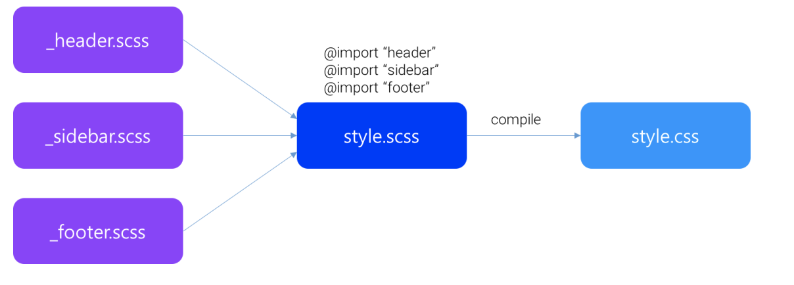

# SASS
원래 ruby로 만들어졌다. 수업 편의상 node.js로 컨버전된 버전도 있다.

## 설치
```
ogtaeg-im-ui-MacBook-Pro:~ downmix$ npm install -g node-sass
ogtaeg-im-ui-MacBook-Pro:~ downmix$ node-sass -v
node-sass 4.5.3 (Wrapper) [JavaScript]
libsass  3.5.0.beta.2 (Sass Compiler) [C/C++]
```

## 컴파일
style.scss 를 컴파일 하여 style.css
```
node-sass foo.scss > bar.css
node-sass src/sass --output dist/css
```
모니터링 하며 반영
```
node-sass --watch src/sass --output dist/css
```
- 표준적인 레이아웃 --output-style expanded  
- 공백을 최대한 제거하여 압축--output-style compressed

## sass 연산자
```css
width: $width + 10; // 110px
width: $width + 10in; // 1060px
```
연산시 좌측에 있는 것을 기준으로 단위가 설정되어 연산된다.
만약 연산대상을 변환하지 못하는 경우면 에러가 발생한다.

### `/`
css에서는 나눗셈이 아닌 값을 분리하는 의미.  
sass에서 나눗셈을 하기위해서는
```css
width: $width / 2; 
// 변수에 대해 사용 →　width: 500px; 
height: (500px / 2); 
// 괄호 내에서 사용 →　height: 250px; 
margin-left: 5px + 8px / 2px; 
// 다른 연산의 일부로서 사용 →　margin-left: 9px;
```
### 컬러연산
```css
color: #010203 + #040506; 
// R: 01 + 04 = 05 
// G: 02 + 05 = 07 
// B: 03 + 06 = 09 
// => #050709

color: #010203 * 2; 
// R: 01 * 2 = 02 
// G: 02 * 2 = 04 
// B: x03 * 2 = 06 
// => #020406

color: rgba(255, 0, 0, 0.75) + rgba(0, 255, 0, 0.75); 
// alpha 값은 연산되지 않는다 // color: rgba(255, 255, 0, 0.75);
```

alpha를 연산하기 위해서는 아래 함수를 사용해야한다.

```css
color: opacify(rgba(255, 0, 0, 0.5), 0.3); 
// color: rgba(255, 0, 0, 0.8); 

background-color: transparentize(rgba(255, 0, 0, 0.5), 0.25); 
// background-color: rgba(255, 0, 0, 0.25);
```
### 문자열 연산자
+로 문자열을 연결할수있다.
```css
content: "Foo " + Bar; // "Foo Bar" 
font-family: sans- + "serif"; // sans-serif
```
## 리스트
리스트 요소수 반환
- length(10px) => 1 
- length(10px 20px 30px) => 3 
- length((width: 10px, height: 20px)) => 2

리스트의 n번째
- nth(10px 20px 30px, 1) => 10px 
- nth((Helvetica, Arial, sans-serif), 3) => sans-serif 
- nth((width: 10px, length: 20px), 2) => length 20px 

##  Ampersand(&)
```css
a { 
  color: #ccc; 
  &.home { color: #f0f; } 
  &:hover { text-decoration: none; } 
  // & > span (X) 
  > span { color: blue; } 
  span { color: red; } 
}
```
위를 컴파일 하면 아래처럼 변환된다.

```css
a { color: #ccc; } 
a.home { color: #f0f; } 
a:hover { text-decoration: none; } 
a > span { color: blue; } 
a span { color: red; }
```

## !default
!default flag는 할당되지 않은 변수의 초기값을 설정한다.  

```css
$content: null; 
$content: "Non-null content" !default; 
#main { 
  content: $content; // "Non-null content" 
}
```

이미 값이 할당되어 있는 변수에 !default를 사용하면 적용되지 않는다.  
이 옵션은 sass를 partial 형태(각 부분 별개파일로 나누어서 작업한 뒤 합치는)에서 유용하다.


# SASS 확장기능
## Nesting
선언을 중첩한다
```css
#navbar {
  width: 80%; height: 23px; 
  ul { list-style-type: none; } 
  li {
    float: left; 
      a { 
      font-weight: bold; 
      } 
  } 
}
```

선언을 중첩해서 사용할수 있는데 너무 깊게(tab) 하면 가독성이 좋지않다.

## @import
규모가 큰 프로젝트 일수록 css 관리하기가 어렵다.
가독성이나, 협업시 파일들을 분리하여 합치는 방식으로 하면 효과적이다.



파일명 앞에 _ 를 붙이게되면 컴파일이 되지 않는다.


하지만 import를 사용하여 중앙scss파일을 사용할 경우 scss가져와서 style.scss 에서 컴파일을 한다.


## `@extend`
기존 스타일을 상속 할때 사용한다.  
하지만 컴파일시 어떻게 셀렉트 될지 예상되지 못한 부작용이 있어 사용하지않고 mixin를 사용한다

## if( )
```css
color: if($type == ocean, blue, black);
// color: blue;
```
if ( 조건, true, false )

## @if
```css
p { 
  @if $type == ocean {
    color: blue; 
  } @else if $type == matador { 
    color: red; 
  } @else {
    color: black;
  }
}
```

## @for
```css
@for $i from 1 through 3 { 
  .item-#{$i} { width: 2em * $i; }
}
```

## @each
```css
@each $animal in puma, sea-slug, egret, salamander { 
  .#{$animal}-icon { 
    background-image: url('/images/#{$animal}.png'); 
  } 
}

@each $header, $size in (h1: 2em, h2: 1.5em, h3: 1.2em) { 
  #{$header} { 
    font-size: $size;
  }
}
```

## Mixin
extend와 비슷하지만 argument를 받을수 있다.
@mixin 선언하고 @include 로 부른다.

```css
@mixin circle { 
  width: 50px; height: 50px; border-radius: 50%;
}

.box {
  @include circle; 
  background: #f00; 
}
```
아래처럼 argument를 사용할수도 있다.

```css
@mixin circle($size) {
  width: $size; height: $size; border-radius: 50%; 
}

.box {
  @include circle(100px); 
  background: #f00; 
}
```
### 활용예시
브라우저별 옵션
```css
@mixin css3($property, $value) { 
  @each $prefix in -webkit-, -moz-, -ms-, -o-, '' {
    #{$prefix}#{$property}: $value; 
   } 
} 

.border_radius {
 @include css3(transition, 0.5s);
}
```
컴파일
```css
.border_radius { 
-webkit-transition: 0.5s; 
-moz-transition: 0.5s; 
-ms-transition: 0.5s; 
-o-transition: 0.5s; 
transition: 0.5s; 
}
```
자주 사용하는 position
```css
@mixin absPosition ($top: auto, $right: auto, $bottom: auto, $left: auto) { 
  position: absolute;
  top: $top; right: $right; bottom: $bottom; left: $left;
} 

.box {
  @include absPosition(5px, 20px, 10px, 15px); 
}
```

## 주석
css에는 /* */만 쓸수있지만, sass에서 // , /* */둘다 사용할수있다.


다른점은 //는 컴파일후 사라지고, /* */는 css에 남는다.
