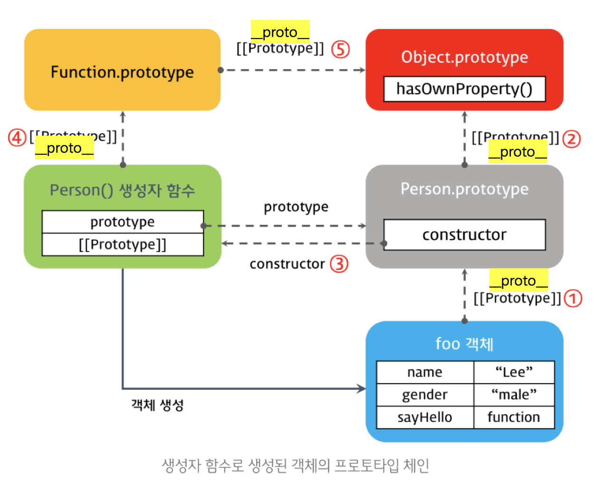

# 프로토타입 생성

# 객체 리터널 방식의 생성


## 생성자 함수로 생성된 객체의 프로토타입 체인
- 함수선언식(Function declaration) 
  내부적으로 기명 함수표현식으로 변환된다.
- 함수표현식(Function expression) 
  함수 리터널방식으로 함수정의
- Function() 생성자 함수

모든 프로토타입 함수는 결국 Function() 생성자를 사용한다.

## 기본자료형 확장
기본적으로 기본자료형(숫자, 문자, boolean, null, undefined) 은 객체가 아니다.  
하지만 메서드 호출시 일시적으로 객체로 변환되어 프로토타입 객체를 사용할수있다.  

### 사용자 추가 메서드
```javascript
var str = 'test';
String.prototype.myMethod = function () {
  return 'myMethod'; 
};
str.myMethod();
```
위와 같이 선언하면 사용할수 있다.

> 하지만 표준이 아니고 협업간 혼동이 있을수 있기때문에 권장하지 않는다. 별개의 라이브러리를 작성하는것이 좋음. 

# Scope 스코프

- 전역 Scope : 코드를 어디든지 참조할수있다.
- 지역 Scope : 정의된 함수내에서 참조할수있다.

지역변수는 함수 블록 내에 선언된것. Scope도 함수 블록 내에 있다.

## 글로벌 scope
글로벌 영역에 선언하면 글로벌 scopre에 사용할 수 있다.  
전역변수는 window의 프로퍼티이다. 생략이 가능해서 바로 호출하면 된다.  
`setTimeout === window.setTimeout`

JS는 블록레벨scope 를 지원하지 않기때문에 if 나 일반블록에서 전역변수로 선언 된다.  
다만 function scope에서 선언하면 지역변수로 선언된다.   
중첩함수 내 지역변수를 사용하면 같은 블록부터 하여 상위 블록의 변수를 가져오게된다.

## Lexical scoping (Static scoping)
함수의 문법적인 scope를 갖는다.
```javascript
var i = 5; 
function foo() { 
  var i = 10; 
  bar();
} 

function bar() { 
// 선언된 시점에서의 scope를 갖는다! 
  console.log(i); 
} 

foo(); // 5
```

## 전역변수의 위험성
각각 js 파일에서 변수 선언시 var를 생략하며 이름이 중복되면 의도하지 않는 동작된다.  
때문에 전역변수를 최소한 사용해야한다.

### 우회법
#### 전역변수용 객체
```javascript
var MYAPP = {}; 
MYAPP.student = { name: 'Lee', gender: 'male' }; 
console.log(MYAPP.student.name);
```

위 처럼 전역변수 객체를 통해 전역변수를 관리 할 수있다.

#### IIFE 즉시실행함수 활용
IIFE사용하면 전역변수를 사용이 완료되면 그후 전역에서 바로 사라진다.


# this
this는 전역 객체. argument 처럼 암묵적으로 전달된다.

## 메소드 호출 패턴(Method Invocation Pattern)
```javascript
var obj1 = {
  name: 'Lee',
  sayName: function() {
    console.log(this.name);
  }
}
```

함수가 객체 프로퍼티면 메서드호출 패턴으로 호출된다.  
이때 this는 해당 메소드를 호출한 객체 바인딩된다.  
자신을 호출한 객체를 바인딩한다.  

## 함수 호출 패턴(Function Invocation Pattern)
전역객체는 최상위 객체를 의미하며 브라우저에서는 window, 서버(node)에서는 global 이 된다.
```javascript
function foo() { 
  console.log("foo's this: ", this); // window 
  function bar() {
    console.log("bar's this: ", this); // window
  } 
  bar();
}

var value = 1;
var obj = {
  value: 100,
  foo: function() {
    console.log("foo's this: ", this); // obj 
    console.log("foo's this.value: ", this.value); // 100 
    function bar() {
      console.log("bar's this: ", this); // window
      console.log("bar's this.value: ", this.value); // 1
    }
    bar();
  }
};
```
위처럼 설계상 오류가 있기때문에 `var THAT = this;` 같은 우회를 해야한다.

## 생성자 호출 패턴(Constructor Invocation Pattern)
new 연산자와 함께 생성자 함수를 호출하면, 생성자 내 this는 생성자가 생성한 객체를 호출 한다.
```javascript
var Person = function(name, gender) {
  this.name = name;
  this.gender = gender;
}
var me  = new Person('Lee', 'male');
```

## apply 호출 패턴(Apply Invocation Pattern)
내부적인 바인딩 외에 this를 특정 객체에 명시적으로 바인딩하는 방법도 제공된다
```javascript
var Person = function (name) {
  this.name = name;
};
var foo = {};
Person.apply(foo, ['name']);
console.log(foo); 
```

apply 메소드는 생성자함수 Person을 호출한다. 이때 this는 객체 foo를 바인딩한다.  
apply(), call()를 사용할수있는데, apply는 두번째 인자에서 배열형태로, call은 각각 인자로 넘긴다. 그 외에는 동일하다.
```javascript
Person.apply(foo, [1, 2, 3]); 
Person.call(foo, 1, 2, 3);
```