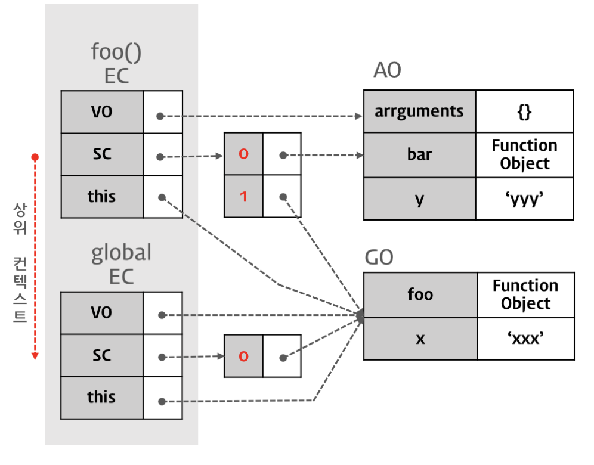

# 실행컨텍스트
실행 가능한 코드블럭이 실행되는 환경
- 전역코드 : 전역영역에 존재하는 코드
- eval코드 : eval 함수로 실행 (보안문제가 있어서 사용안함)
- function : 함수내 존재하는 코드


```javascript
var x = 'xxx'; 
function foo () { 
  var y = 'yyy'; 
  function bar () {
  var z = 'zzz'; 
   console.log(x + y + z);
  }  
  bar(); 
} 
foo();
```

(스택구조의 실행 컨텍스트)

- 스택구조로 이루어져 선입후출로 이루어 진다.
- 처음 글로벌코드로 접근하면 실행컨텍스트 스택에 쌓이기 시작한다. 
- 전역실행 컨텍스트는 웹페이지 나갈때 까지 유지된다.
- 함수가 호출되면 스택에 쌓이게 된다.
- 함수가 끝나면 컨텍스트를 날리고 이전 컨텍스트로 이관된다.
 

# 실행 컨텍스트 객체의 프로퍼티
실행 컨텍스트가 생성되면 js엔진은 실행에 필요한 여러 정보들을 담을 객체를 생성한다.

##VO 변수객체 (Variable Object)
VO에는 변수, 매개변수&인수, 함수선언(함수표현식 제외) 있다.
- GO 전역객체


- AO 활성객체


## Scope Chain (SC)
스코프 체인은 리스트로 스코프 레퍼런스를 가진다.  
현재 실행 컨텍스트 부터 글로벌 까지 리스트를 가진다.



## this 
this에는 함수호출 패턴에 따라 this값이 할당된다.


# 실행 컨텍스트 생성과정
```javascript
var x = 'xxx'; 
function foo () { 
  var y = 'yyy';
  function bar () { 
    var z = 'zzz';
     console.log(x + y + z);
  }
  bar();
}

foo();
```
위 코드는 아래와 같이 실행컨텍스트가 된다.


# 클로저 (closure)
- 클로저는 '내부함수'를 위한 '외부함수 지역변수'가 '외부함수'에 의해 '내부함수가 반환'된 이후에도 life-cycle이 '유지되는 것'을 의미한다.
- js만의 고유기능이 아닌 함수를 일급객체로 취급하는 언어들이 사용한다. (Python, Haskell, Perl)

```javascript
function outerFunc() { 
  var x = 10; 
  var innerFunc = function () {
    console.log(x); 
  };
  return innerFunc;
} 
var inner = outerFunc(); // 클로저의 형성
```

원래대로라면 outerFunc는 함수를 반환하고 실행컨텍스트가 끝나 없어지지만, 실제론 inner x가 정상적으로 출력된다.


외부함수보다 내부함수가 더 오래 유지되는데, 내부함수가 외부함수의 지역변수에 접근 할 수 있고,  
외부함수는 외부함수의 지역변수를 사용하는 내부함수가 소멸될 때까지 소멸되지 못하고 상태가 유지되며 내부함수에 의해서 소멸하게 되는 특성을 클로저라 한다.


## 클로저 활용
클로저는 자바스크립트의 강력한 기능이기는 하나 성능적인 면과 자원적인 면에서 손해를 볼 수 있다. 

무분별한 클로저의 사용은 적절하지 않다.

### 전역변수 사용 억제
```javascript
var add = (function () { 
  var counter = 0;
  return function () {
    return counter += 1; 
  } 
})();

add();
```
변수 counter는 외부에서 접근못하는 private 이기 때문에 전역변수처럼 변경되지 않는다.

```javascript
var arr = []; 
for (var i = 0; i < 5; i++){ 
  arr[i] = (function (id) {
    return function () {
      return id;
      }; 
  })(i); 
}

for (var index = 0; index < arr.length; index++) {
  console.log(arr[index]()); 
}
```