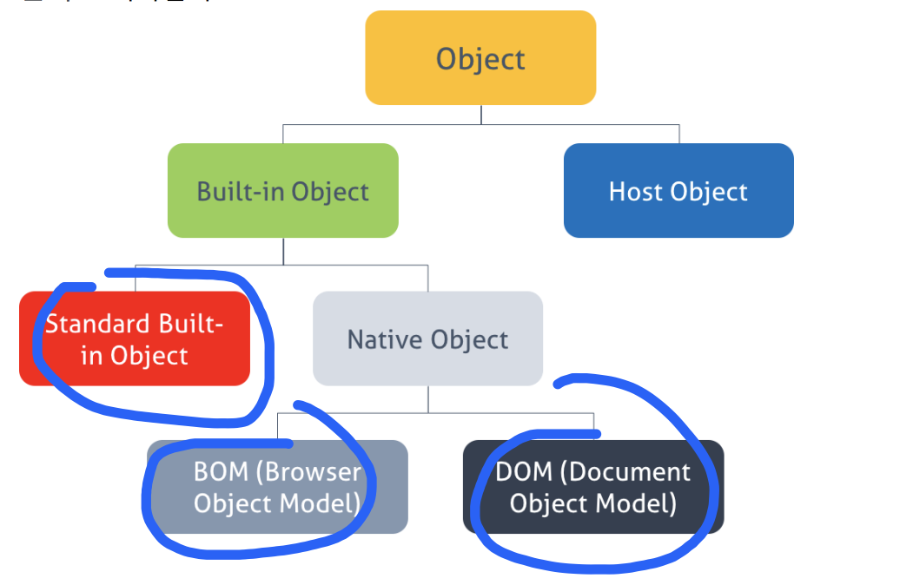
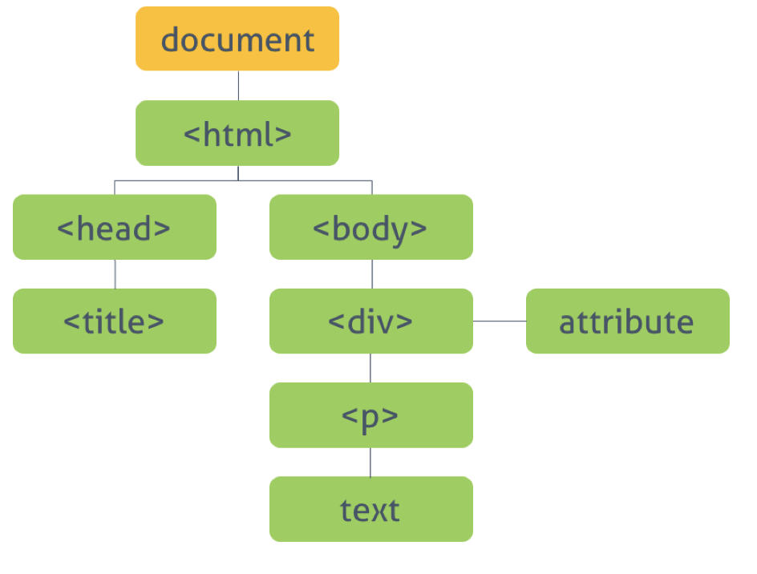
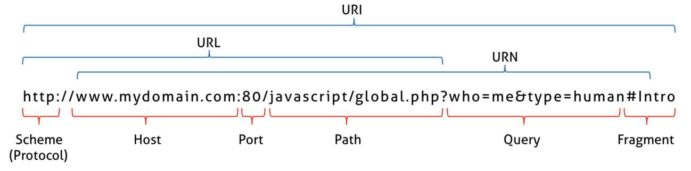

# 내장객체 (Built-in Object)
웹페이지 등을 표현하기 위한 공통의 기능을 제공한다.
- 표준 빌트인 객체 Standard Built-in Objects (or Global Objects)
  js는 프로그램 전체의 영역에서 공통적으로 필요한 기능을 사용자 각자가 일일히 작성하는 수고를 줄이기 위해 Standard Built-in Objects를 제공한다. String, Array와 같이 대문자로 시작한다.

- BOM (Browser Object Model)
브라우저 객체 모델은 브라우저 탭 또는 브라우저 창의 모델을 생성한다.   
최상위 객체는 window 객체로, 현재 브라우저 창 탭을 표현하는 객체.

- DOM (Document Object Model)
문서 객체 모델은 현재 웹페이지의 모델을 생성한다.  생성시 트리구조로 이루어 지며,
최상위 객체는 document 객체로 표현 한다.

# 전역객체
전역객체는 최상위에 유일한 객체이며 브라우저에서는 window, 서버사이드(노드) global 객체이다.

##전역 프로퍼티
### Infinity
양수 음수의 무한대를 나타내는 숫자

console.log(3/0); // Infinity 
console.log(-3/0); // -Infinity 
console.log(Number.MAX_VALUE * 2); // 1.7976931348623157e+308 * 2 console.log(typeof Infinity); // number

### NaN
숫자값이 아닌 숫자
console.log(Number('xyz')); // NaN 
console.log(1 * 'string'); // NaN 
console.log(typeof NaN); // number
 
### undefined
변수에 값이 대입되지 않음. 

## 전역 함수
### eval()
파라미터로 전달된 문자열을 실행한다.
보안문제로 사용하지 않는것이 좋다.

### isFinite()
값이 유한숫자, 정상적인 숫자인지 결과를 boolen으로 반환한다.
console.log(isFinite(0)); // true 
console.log(isFinite(2e64)); // true 
console.log(isFinite(null)); // true: null->0

console.log(isFinite(Infinity)); // false 
console.log(isFinite(NaN)); // false 
console.log(isFinite('Hello')); // false

### isNaN()
값이 NaN 인지 확인한다. 
isNaN(37) // false
isNaN('blabla') // true: 'blabla' -> NaN

isNaN(true) // false: true -> 1 
isNaN(null) // false: null -> 0
isNaN('37') // false: '37' -> 37
isNaN('') // false: '' -> 0

### parseFloat()
문자열을 부동소수점(float)로 변환된다.
parseFloat('3.14'); // 3.14 
parseFloat('10.00'); // 10 
parseFloat('34 45 66'); // 34 
parseFloat('40 years'); // 40 
parseFloat('He was 40') // NaN

### parseInt()
값을 정수형숫자로 변환한다.
parseInt('0x20'); // 32 
parseInt('10', 16); // 16 
parseInt('10', 8); // 8 
parseInt('40 years'); // 40 
parseInt('He was 40') // NaN

### encodeURI() / decodeURI()

# 표준 빌트인 객체 Standard Built-in Objects (Global objects)

## Object
var obj = new Object('String'); 
console.log(typeof obj + ': ', obj); 
console.dir(obj);

## Function
var adder = new Function('a', 'b', 'return a + b'); 
adder(2, 6); // 8

## Error
error 객체를 생성한다. 런타임에러가 발생할때 throw 된다.

try { 
  // foo(); 
  throw new Error('Whoops!'); 
} catch (e) { 
  console.log(e.name + ': ' + e.message); 
}
> 관련객체 : EvalError, InternalError, RangeError, ReferenceError, SyntaxError. TypeError. URIError

숫자 > 문자	문자 > 숫자
'' + num	1 * '12'
toString	paserInt
	Number('12')

## Number ()
숫자로 변환된다.
var x = new Number(123);  //123
var y = new Number('123');  //123
var z = new Number('str');  //NaN

### Number.EPSILON
Js에서 표현되는 가장 작은 수.   
부동소수점의 특성상 0.1같은건 무한소수로 취급되기 때문에 정확한 계산이 어렵다. 
때문에 EPSILON를 활용하여 해결한다.
console.log(0.1 + 0.2); // 0.30000000000000004 
function isEqual(a, b){ 
  // Math.abs는 절대값을 반환한다. 
  // 즉 a와 b의 차이가 JavaScript에서 표현할 수 있는 가장 작은 수인 Number.EPSILON보다 작으면 같은 수로 인정할 수 있다. 
  return Math.abs(a - b) < Number.EPSILON; 
} 
console.log(isEqual(0.1 + 0.2, 0.3));

### Number.POSITIVE_INFINITY
양의 무한대를 반환 Infinity

### Number.NEGATIVE_INFINITY
음의 무한대를 반환 -Infinity

### Number.MAX_VALUE
자바스크립트에서 사용 가능한 가장 큰 숫자. 이것보다 더 크면 Infinity가 된다.
Number.MAX_VALUE; // 1.7976931348623157e+308 

### Number.MIN_VALUE
자바스크립트에서 사용 가능한 가장 작은 숫자. 0에 가까운 양수값이다. 
MIN_VALUE보다 작으면 0으로 처리된다.
Number.MIN_VALUE; // 5e-324

### Number.isFinite()
 값이 유한수인지, 정상적인 수인지를 반환한다.
Number.isFinite('Hello') // false
Number.isFinite(0) // true 
Number.isFinite(2e64) // true
Number.isFinite(null) // false. isFinite(null) => true

### Number.isInteger()
값이 정수(int)인지 확인하여 결과를 반환한다.
Number.isInteger(123) //true 
Number.isInteger(-123) //true 
Number.isInteger(5-2) //true
Number.isInteger(0.5) //false 
Number.isInteger('123') //false 
Number.isInteger(false) //false

### Number.isNaN()
값이 NaN인지 확인하여 결과를 반환
Number.isNaN(null) // false
Number.isNaN(37) // false 
Number.isNaN('37'); // false

### Number.isSafeInteger()
 값이 안전한 정수값인지 검사하여 그 결과를 반환한다.
Number.isSafeInteger(123) //true 
Number.isSafeInteger(-123) //true 
Number.isSafeInteger(5-2) //true
Number.isSafeInteger(10000000000000001) // false 
Number.isSafeInteger(0.5) //false 
Number.isSafeInteger('123') //false 
Number.isSafeInteger(false) //false

### Number.[prototype].toExponential()
대상을 지수 표기법으로 변환하여 문자열로 반환한다.  매우 큰 숫자를 표기할 때 주로 사용.

### Number.[prototype].toFixed()
지정한 소수자리를 반올림한다.

### Number.[prototype].toPrecision()
전체 자리수 기준으로 반올림한다,

### Number.[prototype].toString()
숫자를 문자열로 반환한다.

### Number.prototype.valueOf()
Number 객체의 기본자료형 값(primitive value)을 반환한다.

## Math

### Math.PI
파이 값(3.14......) 을 반환한다.

### Math.abs()
절대값을 반환

### Math.round()
숫자를 가장 인접한 정수로 반올림/내림 한다.

### Math.sqrt()
양의 제곱근을 반환한다.

### Math.ceil()
무조건 반올림

### Math.floor()
무조건 내림

### Math.random()
0~1사이의 임의숫자를 반환한다. 1은 포함하지 않는다.

### Math.pow()
첫번째 인수를 밑(base), 두번째 인수를 지수(exponent)로하여 거듭제곱을 반환한다.
Math.pow(7, 2); // 49 
Math.pow(7, 3); // 343

### Math.max()
최대값을 반환한다.
var arr = [1, 2, 3]; 
var max = Math.max.apply(null, arr);
// ES6 
var max = Math.max(...arr); 

### Math.min()
최소값을 반환한다.
Math.min( 1, 2, 3 ); // 1

var arr = [1, 2, 3]; 
var min = Math.min.apply(null, arr); // 그냥실행하면 NaN으로 나온다. 객체 object이기 때문에.

// ES6 
var min = Math.min(...arr); // 1
