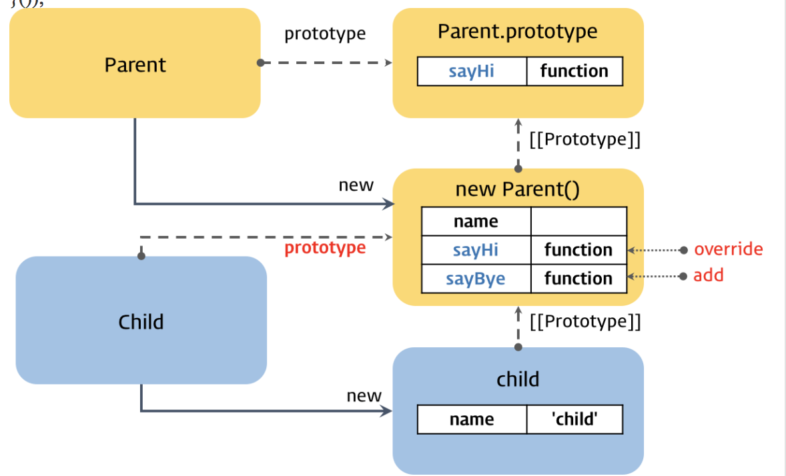

# 객체지향프로그래밍 
JS도 역시 객체지향 프로그래밍 가능.  
객체지향에는 추상화, 상속, 캡슐화 특성이 있다.

## 클래스 기반, 프로토타입 기반
클래스기반은 JAVA, C++ 와 같은 클래스로 객체의 자료구조와 기능을 정의하고, 생성자를 통해 인스턴스로 생성한다.

js는 멀티패러다임 언어로 명령형, 함수형, 프로토타입 기반 객체지향언어 이다.  
클래스 개념이 없는대신, 비슷한 객체생성방법이 있다.
- 객체리터럴, Object() 생성자 함수
- 생성자 함수
```javascript
// 객체 리터럴
var obj1 = {};
obj1.name = 'Lee';
// Object() 생성자 함수
var obj2 = new Object();
obj2.name = 'Lee';
// 생성자 함수
function F() {}
var obj3 = new F();
obj3.name = 'Lee';
```

- 객체지향의 상속, 캡슐화(은닉) 은 프로토타입체인, 클로저로 구현할수있다.
- JS에서는 이미 생성된 인스턴스의 구조를 동적으로 변경이 가능하다.
- ES6에서는 class가 있는데 위와 같은 슈거신택스 이므로 위 방법과 동일하다.

## 상속
### 의사 클래스 상턴 상속
가짜클래스. 단점이 있어 잘 안쓰는패턴
자식 생성자 함수의 prototype 프로퍼티를 부모 생성자 함수의 인스턴스로 교체해 상속을 구현한 패턴.
```javascript
//부모
var Parent = (function () { 
  function Parent(name) { 
    this.name = name; 
  }
  Parent.prototype.sayHi = function () { 
    console.log('Hi! ' + this.name); 
  }; 
  return Parent; 
}());

//자식
var Child = (function () { 
  function Child(name) { 
    this.name = name; 
   } 
  // 자식 생성자 함수의 프로토타입 객체를 부모 생성자 함수의 인스턴스로 교체. 
  Child.prototype = new Parent(); 
  // 메소드 오버라이드 
  Child.prototype.sayHi = function () {
    console.log('안녕하세요! ' + this.name); 
  };
 // sayBye 메소드는 Parent 생성자함수의 인스턴스에 위치된다 
  Child.prototype.sayBye = function () { 
    console.log('안녕히가세요! ' + this.name); 
  }; 
  return Child; 
}()); 
```


위 방법은 자식생성자 함수의 프로토타입을 부모생성자 함수로 바꾼방법이다.
기능상으로는 잘 동작하지만, 생성자 링크를 파괴했기때문에 constructor 도 Parent를 보게 되고 new 키워드를 사용안하면 this가 전역으로 가는 문제가 발생한다.


### 프로토타입 패턴 상속
Object.create( ) 함수를 사용하여 상속을 구현한다.

```javascript
// 부모 
var Parent = (function () { 
  function Parent(name) { 
    this.name = name; 
  } 
  Parent.prototype.sayHi = function () { 
    console.log('Hi! ' + this.name); 
  }; 
 return Parent; 
}()); 
//자식
var child = Object.create(Parent.prototype); 
child.name = 'child';

Object.create() 함수는 프로토타입으로 설정할 객체,인스턴스를 전달하고, 이것을 상속하는 새로운 객체를 만든다.

var child = Object.create(Parent.prototype);
IE9 이상부터 지원하기 때문에 호환성으로 방어코드가 필요하다.
if (!Object.create) { 
  Object.create = function (o) { 
    function F() {}  
     F.prototype = o; 
    return new F();  
  }; 
}
```
위 코드로 폴리필(방어코드) 프로토타입 패턴 상속의 핵심이다.

## 캡슐화, 모듈패턴
캡슐화는 변수, 메서드를 하나의 클래스에 담고 외부에 공개할것을 정의하고 숨겨서 데이터를 보호하는 은닉성을 가지고 있다.
JAVA의 private같은 건데 JS에는 이런 문법이 없다.
때문에 아래와 같은 방법으로 대체한다.
```javascript
var person = function(arg) { 
  var name = arg ? arg : ''; 
  return { 
     getName: function() { return name; }, 
     setName: function(arg) { name = arg; } 
   } 
}

var me = person('Lee'); 
/* or var me = new person('Lee'); */ 
var name = me.getName();
```

person함수는 객체를 반환하게되고, 클로저를 통해 위처럼 get, set 메서드와 name변수에 접근할수있게 된다. 이 방식을 모듈패턴이라 한다.

다만, 반약 배열이나 객체가 return되는경우 해당 멤버변경이 가능하다.
객체를 반환하는경우 얕은복사(shallow copy)로 참조값이 반환되는데, 참고값이기 때문에 외부에서 수정이 가능해진다.
때문에 깊은복사(deep copy)를 통해 반환해야한다.
```javascript 
var Person = function() {
  var name;
  var F = function(arg) {
    name = arg ? arg : '';
  };
  F.prototype = {
    getName: function() { return name; }, 
    setName: function(arg) { name = arg; } 
  };
  return F; 
}(); 

var me = new Person('Lee'); 

console.log(me.getName()); 
me.setName('Kim');
console.log(me.getName());
```