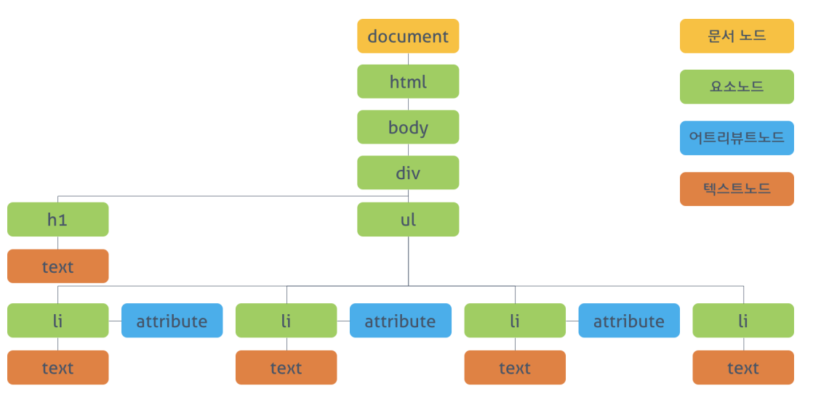
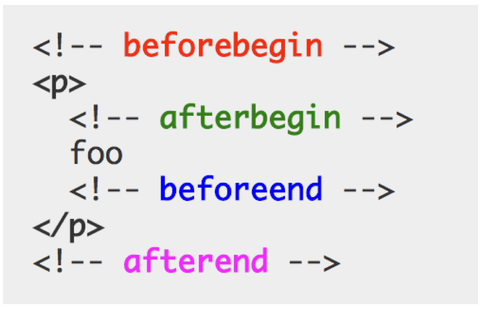

# DOM
html, JS에서 정의한 표준이 아닌, W3C의 별개 표준이다.  
웹문서의 DOM을 접근하거나 조작하기 위해서는 JS로 제공되는 DOM api를 사용한다.  
브라우저는 HTML 문서를 로드한 후 해당 문서에 대한 모델을 메모리에 생성한다. 이때 모델은 객체의 트리로 구성되는데 이것을 DOM tree라 한다.

## DOM tree
브라우저가 HTML 문서를 로드한 후 생성할대 객체의 트리로 구조화 되어있다.


## DOM 쿼리
DOM요소의 접근 js명령
### document.getElementById( id )
- id 어트리뷰트 값으로 요소 노드를 한개 선택한다. 
- 모든 브라우저에서 가능
```js
// id로 하나의 요소를 선택한다. 
var elem = document.getElementById('one'); 
// 클래스 어트리뷰트의 값을 변경한다. 
elem.className = 'blue'; 
```

### document.querySelector( cssSelect )
- CSS 셀렉터를 사용하여 요소 노드를 한개 선택한다. 
- 여러개가 있으면 첫번째 요소만 반환한다.
- IE8 이상
```js
// CSS 셀렉터를 이용해 요소를 선택한다
var elem = document.querySelector('li.red');
```

### document.getElementsByClassName( class )
- class의 속성값으로 요소 노드를 모두 선택한다. 공백으로 구분하여 여러개의 class를 지정할 수 있다.
- IE9 이상
```js
var elems = document.getElementsByClassName('red');
```

이 속성으로 여러 노트를 선택하여 elems[0]식으로 배열로 여러개를 관리할수가 있는데,  
실시간으로 노드상태변경되기 때문에 반복문을 사용하여 변경하는식으로 코드를 처리하게 되면 원하는 명령이 실행되지 않을수 있다. 


그 이유는 배열처럼 보이지만, 유사배열(array-like object)로 실시간으로 유동적으로 변경된다.  
반복문을 역순으로 처리하거나, 유사배열을 분리하여 배열형태로 작업해야 한다.

### document.getElementsByTagName( tagName )
- 태그명으로 요소 노드를 모두 선택한다.
- 모든 브라우저에서 동작

### document.querySelectorAll( cssSelect )
- CSS 선택자를 사용하여 요소 노드를 모두 선택한다.
- 모든 브라우저

## DOM탐색
### parentNode
- 부모 노드를 탐색한다.
- 모든 브라우저
```js
var elem = document.getElementById('two'); 
var parentNode = elem.parentNode;
```

### firstChild, lastChild
- 자식노드 탐색한다.
- IE9 이상
```js
var elem = document.getElementsByTagName('ul')[0]; 

elem.firstChild.className = 'blue'; 
elem.lastChild.className = 'blue';
```
각 노드의 처음, 끝을 찾을때 막상 제대로 동작하지 않을수있다.  
그 이유는 브라우저에서는 요소사이에 빈문자, 줄바꿈을 다른 텍스트노드로 취급되기 때문에 원하지 않는 공백요소가 선택될수있다.


이를 우회하기 위해서는 html공백을 제거하거나, lastElementChild 같은 속성을 사용해야 한다.

### hasChildNodes()
자식 노드가 있는지 확인하고 Boolean 반환한다.

### childNodes
자식 노드의 컬렉션을 반환한다. 

### nextSibling, previousSibling
- 형제노드를 탐색한다.
- IE9이상에서 동작

## DOM 조작
### 텍스트 노드의 접근
- 해당 텍스트 노드의 부모 노드를 선택한다. 텍스트 노드는 요소 노드의 자식이다.
- firstChild 프로퍼티를 사용하여 텍스트 노드를 탐색한다.
- 텍스트 노드의 유일한 프로퍼티(nodeValue)를 이용하여 텍스트를 취득한다.
- nodeValue를 이용하여 텍스트를 수정한다.
```js
// 해당 텍스트 노드의 부모 요소 노드를 선택한다.
var one = document.getElementById('one');
console.dir(one); // HTMLLIElement: li#one.red
 
// firstChild 프로퍼티를 사용하여 텍스트 노드를 탐색한다.
var textNode = one.firstChild;
 
// nodeValue 프로퍼티를 사용하여 노드의 값을 취득한다.
console.log(textNode.nodeValue); // Seoul
 
// nodeValue 프로퍼티를 이용하여 텍스트를 수정한다.
textNode.nodeValue = 'Pusan';
```

### attribute 노드의 접근
- className   
class 속성값을 취득하거나 변경한다.
- id  
id 속성값을 취득하거나 변경한다. 
- hasAttribute (' ')  
지정한 속성을 가지고 있는지 검사하여 boolean으로 반환한다.
- getAttribute( ' ')  
속성값을 반환한다.
- setAttribute(' ' , value)  
속성과 속성값을 설정한다.
- removeAttribute(' ')  
지정한 속성을 제거한다.

## HTML 콘텐츠 조작
- textContent  
요소의 텍스트 콘텐츠를 취득 또는 변경한다. 이때 마크업은 무시된다. textContent를 통해 요소에 새로운 텍스트를 할당하면 텍스트를 변경할 수 있다. 이때 순수한 텍스트만 지정해야 하며 마크업을 포함시키면 문자열로 인식되어 그대로 출력된다.
- innerText  
비표준이며, 실 사용하기에 문제가 많아 사용하지 않는다.
- innerHTML  
해당 요소의 모든 자식 요소를 포함하는 모든 콘텐츠를 하나의 문자열로 취득할 수 있다. 이 문자열은 마크업을 포함한다.

> 마크업을 포함하여 콘텐츠를 추가하는것은 XSS 공격에 취약하다. 보안적인 이슈에 대해 대응이 필요할수도 있다.

## DOM 조작 방식
- 요소 노드 생성  
createElement() 메소드를 사용하여 새로운 요소 노드를 생성한다. createElement() 메소드의 인자으로 태그 이름을 전달한다.
- 텍스트 노드 생성  
createTextNode() 메소드를 사용하여 새로운 텍스트 노드를 생성한다. 경우에 따라 생략될 수 있지만 생략하는 경우, 콘텐츠가 비어 있는 요소가 된다.
- 생성된 요소를 DOM에 추가  
appendChild() 메소드를 사용하여 생성된 노드를 DOM tree에 추가한다. 또는 removeChild() 메서드를 사용하여 DOM tree에서 노드를 삭제할 수도 있다.

```js
// 태그이름을 인자로 전달하여 요소를 생성
var newElem = document.createElement('li');
 
// 텍스트 노드를 생성
var newText = document.createTextNode('Beijing');
 
// 텍스트 노드를 newElem 자식으로 DOM 트리에 추가
newElem.appendChild(newText);
 
var container = document.getElementsByTagName('ul')[0];
 
// newElem을 container의 자식으로 DOM 트리에 추가
container.appendChild(newElem);
 
var removeElem = document.getElementById('one');
 
// container의 자식인 removeElem 요소를 DOM 트리에 제거한다.
container.removeChild(removeElem);
```

## insertAdjacentHTML()
인자로 전달한 텍스트를 HTML로 파싱하고 그 결과로 생성된 노드를 DOM 트리의 지정된 위치에 삽입한다. 첫번째 인자는 삽입 위치, 두번째 인자는 삽입할 요소를 표현한 문자열이다. 


```js
var one = document.getElementById('one'); 
// 마크업이 포함된 요소 추가
one.insertAdjacentHTML('beforeend', '<em class="blue">, Korea</em>');
```
# 결론
innerHTML vs. DOM 조작 방식 vs. insertAdjacentHTML()
- innerHTML
  - 비교적 빠르고 간편하다. 
  - 1행당 정의한 여러 요소들을 추가할수 있다.
  - XSS공격에 취약하다.
- DOM 조작방식
  - 특정노드 하나 추가할때 적합하다
  - innerHTML보다 느리고 더 많은 코드가 필요하다.
- insertAdjacentHTML()
  - 삽입하는 위치를 정할수있다.
  - 간편한 문자로 추가 할 수 있다.
  - XSS공격에 취약하다.


# 비동기처리
## ajax
기본적으로 브라우저에서 웹페이지를 요청하거나 클릭해서 화면전환되는것은 서버와 통신에 의한것이다. 

요청을 받으면 html를 반환하여 화면 전체를 다시 렌더링하지 않고 일부분만 갱신하면 더 좋은 퍼포먼스를 기대할수있다.

## 동기식, 비동기식


동기식 처리는 직렬적으로 작업을 수행한다.  
순차적으로 실행되며, 완료될때까지 다른작업은 대기한다.

비동기식 처리는 병렬적으로 처리되는데, 작업이 끝나지 않는 상태에서도 대기 하지 않고 처리한다. JS의 이벤트와 timer함수, ajax가 해당된다.

### 쓰레드
브라우저는 단일 쓰레드로 동작한다.  
브라우저의 JS엔진(V8 )은 함수가 실행되면 요청된 작업은 순차적으로 Call Stack에 쌓이게 되고 순차적으로 실행된다. 자바스크립트는 단 하나의 Call Stack을 사용하기 때문에 해당 task가 종료하기 전까지는 다른 어떤 task도 수행될 수 없다.

하지만 실제로 사용하는데에 있어 멀티처리가 되는듯하지만, JS에서 이벤트루프를 지원하기 때문이다.

- Event Queue(Task Queue)  
비동기 처리 함수의 콜백 함수, 비동기식 이벤트 핸들러, Timer 함수(setTimeout(), setInterval())가 보관되는 영역으로, 이벤트 루프에 의해 특정 시점(Call Stack이 비어졌을 때)에 순차적으로 Call Stack으로 이동되어 실행된다.

- Event Loop(이벤트 루프)  
Call Stack내에서 현재 실행중인 task가 있는지 그리고 Event Queue에 task가 있는지 반복하여 확인한다.


# Ajax 요청 및 응답 처리
일반적으로 기본ajax사용이 어려워, jQuery 나 프레임워크를 통해서 사용한다.  
하지만 브라우저는 내부적으로 XMLHttpRequest 객체를 통해 Ajax를 수행한다.
```js
// XMLHttpRequest 객체의 생성
var req = new XMLHttpRequest();
// 비동기 방식으로 Request를 오픈한다
req.open('GET', 'data/test.json', true);
// Request를 전송한다
req.send();
 
// XMLHttpRequest.readyState 프로퍼티가 변경(이벤트 발생)될 때마다 콜백함수(이벤트 핸들러)를 호출한다.
req.onreadystatechange = function (e) {
  // 이 함수는 Response가 클라이언트에 도달하면 호출된다.
 
  // readyStates는 XMLHttpRequest의 상태(state)를 반환
  // readyState: 4 => DONE(서버 응답 완료)
  if (req.readyState === XMLHttpRequest.DONE) {
    // status는 response 상태 코드를 반환 : 200 => 정상 응답
    if(req.status == 200) {
      console.log(req.responseText);
    } else {
      console.log("Error!");
    }
  }
};
```

# JSON
Ajax의 요청의 서버에서는 주로 HTML, XML, JSON 사용한다.  
가장많이 사용하는건 JSON이다.

JS의 객체리터럴과 비슷하지만, 순수 텍스트로 구성된 데이터이다.  
JSON.parse()메소드를 통해서 객체로 변환하여 사용 할 수 있다.

```js
// JSON 형식의 문자열 => 객체
var obj = JSON.parse(strObject);
console.log(typeof obj, obj); // object { name: 'Lee', gender: 'male' }
 
// 문자열 => 배열 객체
var objArray = JSON.parse(strArray);
console.log(typeof objArray, objArray); // object [1, 5, "false"]
```