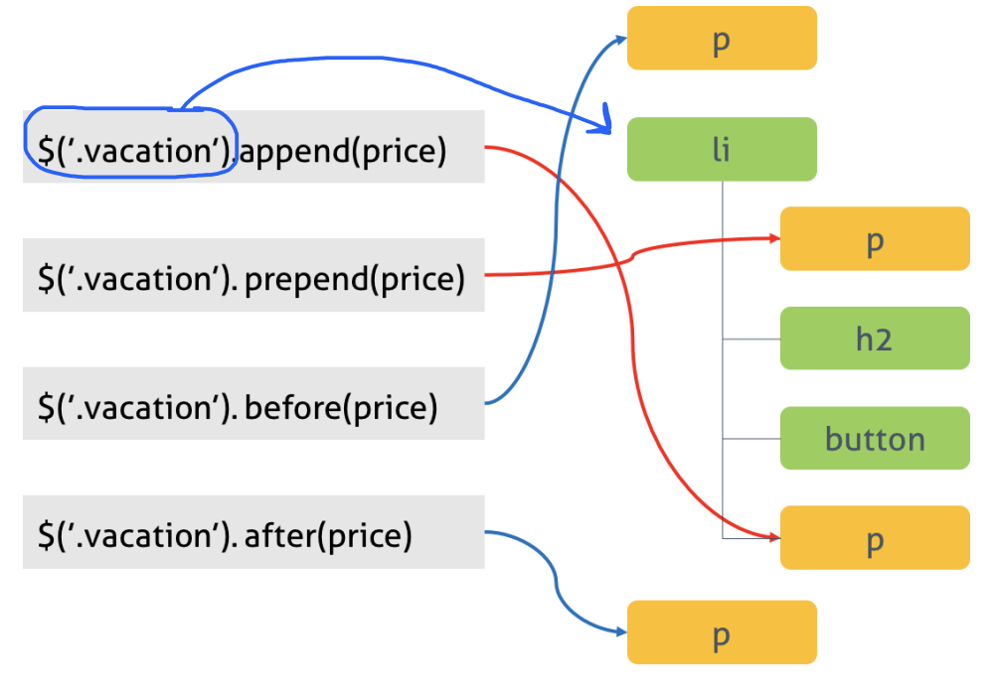

# jQuery
- css스타일의 selector문법을 사용하며, 기본 DOM API보다 직관적이다.
- 브라우저 호환성이 고려되어있어 사용하기 편함
- 이벤트처리, 애니메이션, ajax 처리가 쉬움
- 다양한 플러그인이 존재한다.
 
## 버전
- jQuery 1.x : IE8이하 지원
- jQuery 2.x : IE9이상 지원
 
## Vanilla JS vs jQuery 비교
```js
// vanilla JS
var elem = document.getElementsByTagName('h1');
for (var i = 0; i < elem.length; i++) {
  elem[i].textContent = 'Hello';
}
// jQuery
$('h1').text('Hello');
```

## 함수
### 기본 jQuery 객체
```js
jQuery() == $();
```

### css스타일의 selector 인수로 받을때
```js
$('h1').text('Hello!');
```
h1의 여러개 요소를 담을수 있으며, 반복문없이도 지정이 가능하다.
 
### HTML의 인수로 전달받을때
```js
$('<p id="test">My <em>new</em> text</p>').appendTo('body');
```

### JS객체를 인수로 전달 받을때
jQuery객체로 감싼 객체로 반환한다. 
 
### 콜백함수를 인수로 전달 받을때
```js
$(document).ready(function () {
  // Do something...
});
 
// Shorthand for $(document).ready()
$(function () {
  // Do something...
});
```

DOM이 로드가 다 끝나면 콜백함수로 실행된다.
 
### Selector
```js
// Tag Selector
$('li');
 
// ID Selector
$('#container');
 
// Class Selector
$('.articles');
 
// CSS와 유사하게 자식요소도 선택가능하다
$('#destinations > li').text('Orlando').css('color', 'red');
```
 
### Traversing
selector를 사용하여 matched set생성후 이 요소들과 관련된 다른요소에 접근할수있다.
```js
var el2 = $('#destinations').find('li');
```

### Manipulation 조작
DOM에 요소를 추가, 삭제, 복사, 속성변경 등을 실행한다.
 
#### Appending


#### Removing
remove()를 통해서 요소를 제거한다.
```js 
$('button').remove();
```

### Event
이벤트를 바인딩하고 해당 이벤트가 발생했을 때 실행될 콜백 함수를 지정한다.
```js
//.on
 
$(function () {
    $('button').on('click', function () {
        var price = $('<p>From $399.99</p>');
        $(this).closest('.vacation').append(price);
        $(this).remove();
    });
});
``` 
## Ajax
```js
$.ajax({
  // ajax 통신을 위한 기초설정 세팅
  url: "data/data.html",
  cache: false
  //만약 json이라면
  //url: "data/data.json",
  //dataType: "json"
})
  //ajax 통신 완료후 처리
  // ajax 성공
  .done(function(data, textStatus, jqXHR) {
    $("#content").html(data);
  })
  // ajax 실패
  .fail(function(jqXHR, textStatus, errorThrown){
    console.log("fail: ", jqXHR);
  })
  // ajax 후처리
  .always(function(data, textStatus, jqXHR){
    console.log("always: ", data);
  });
```
 
### jQuery.get()
서버로부터 데이터를 로드한다.
```js
$.get("data/data.html", function(data){
    $("#content").html(data);
});
```

### jQuery.getJSON()
서버로 부터 json 데이터를 로드한다.
```js
$.getJSON("data/data.json", function(data){
    ...
    ...
});
```

### jQuery.load()
서버로부터 html데이터를 로드하고 난뒤 적용한다.
```js
$("#content").load("data/data.html", function(){
    console.log("Load was performed.");
})
```