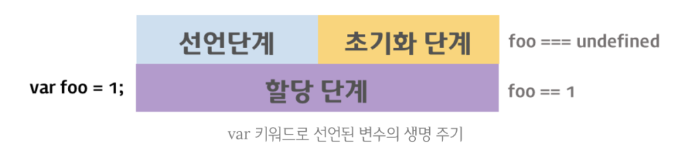

# ECMAScript 6
# 변수
ES5에서는 변수선언시 var키워드를 사용하는데에 있어 여러 문제가 있다.
- 전역변수 남발
- var 생략가능 (의도하지 않는 변수, 전역화)
- 중복선언 허용
- 호이스팅 가능 (변수를 선언하기전에 참조가 가능)
 
## let
- 블록 스코프를 갖는다.
- 중복선언을 허용하지 않는다.
- let키워드는 호이스팅을 안한다. ( 안하는거 처럼 보이게 한다.)

  var 선언법
  

  선언와 초기화를 호이스팅하며 같이 진행한다.

 
  let 선언법
  

선언단계와 초기화단계가 나뉘어져있으며, 변수가 등록은 되지만, 실제 undefined로 초기화는 선언문에 도달할때 이루어진다.
 
- 클로저를 사용하지 않아도 내부함수의 스코프 관리가 가능하다.
 
## const
- 상수(변하지 않는 값) 변수로 사용할 수 있다.
- 초기화 후 재할당이 안된다.
- 상수로 사용할때 암묵적으로 변수명을 대문자로 한다.
- 객체 변수선언은 const를 사용하는것이 좋다.
 
 
# 템플릿 리터럴
\` 백틱 문자를 사용하여 문자열을 담을수 있다.

```js 
const template = `템플릿 리터럴은 '작은따옴표(single quotes)'과 "큰따옴표(double quotes)"를 혼용할 수 있다.`;
const template = `<ul class="nav-items">
  <li><a href="#home">Home</a></li>
  <li><a href="#news">News</a></li>
  <li><a href="#contact">Contact</a></li>
  <li><a href="#about">About</a></li>
</ul>`;
```

아래와 같이 변수명을 담을수 있다.
```js
// 기존의 문자열 연결
console.log('My name is ' + first + ' ' + last + '.');
 
// ES6 String Interpolation
console.log(`My name is ${first} ${last}.`);
 
// 템플릿 대입문에는 문자열뿐만 아니라 표현식도 사용할 수 있다.
console.log(`1 + 1 = ${1 + 1}`); // 1 + 1 = 2
 
const name = 'ungmo';
console.log(`Hello ${name.toUpperCase()}`); // Hello UNGMO
```
 
# 화살표 함수 (Arrow function)
```js 
// 매개변수 지정 방법
    () => { ... } // 매개변수가 없을 경우
(x, y) => { ... } // 매개변수가 여러개인 경우
     x => { ... } // 매개변수가 한개인 경우, 소괄호를 생략할 수 있다.
    () => {
         const x = 10;
         return x * x;
    };
```
Arrow function은 익명함수로만 사용할 수 있기때문에 함수표현식으로 선언한다.
 
```js
const pow = x => x * x;
console.log(pow(10)); // 100
 
const arr = [1, 2, 3];
const pow = arr.map(x => x * x);
 
console.log(pow); // [ 1, 4, 9 ]
```

## rest 파라미터
가변인자를 arguments 를 사용하지 않고 배열로 받을수 있다.

```js 
function sum() {
  // 가변 인자 함수의 경우, 파라미터를 통해 인수를 전달받는 것이 불가능하므로 arguments 객체를 활용하여 인수를 전달받는다. 
  // arguments 객체를 배열로 변환
  var array = Array.prototype.slice.call(arguments);
  return array.reduce(function (pre, cur) {
    return pre + cur;
  });
}
 
console.log(sum(1, 2, 3, 4, 5));
 
// ES6
const sum = (...args) => {
  console.log(Array.isArray(args)); // true
 
  return args.reduce((pre, cur) => pre + cur);
};
 
console.log(sum(1, 2, 3, 4, 5));
```

## this
기본적으로 일반함수에서 this는 전역(window)를 가르킨다.
```js
function Prefixer(prefix) {
  this.prefix = prefix;
}

Prefixer.prototype.prefixArray = function (arr) {
  // (A)
  return arr.map(function (x) {
    return this.prefix + ' ' + x; // (B)
  });
};

var pre = new Prefixer('Hi');
console.log(pre.prefixArray(['Lee', 'Kim']));
//["undefined Lee", "undefined Kim"]
```
(B) 부분의 this는 전역을 바라보게된다. 생성자 함수와 객체의 메소드를 제외한 모든 함수(내부함수, 콜백함수 포함)의 this는 전역객체를 가리키기 때문이다.  
이전에는 `that = this`으로 that키워드를 사용하거나, map함수를 사용하여 this를 바인딩하거나 식으로 대응해야 하지만,  
화살표함수를 사용하면 자신을 포함하고 있는 컨텍스트로 부터 this를 계승 받는다. 


## 화살표함수 주의사항
- 메소드로는 사용하지 말것. (this가 전역객체를 보게된다.)
```js
const obj = {
  name: 'Lee',
  // this를 전역객체를 보게됨. 사용하지 말것
  sayHi: () => console.log(`Hi ${this.name}`)
 
  // === sayHi: function() {
  sayHi() { 
    console.log(`Hi ${this.name}`);
  }
};
 
obj.sayHi(); 
```

- 프로토타입의 메소드로도 사용하지 말것.
- 생성자 함수에 사용하지 말것
  
# 파라미터
 
## 파라미터 초기값
```js
// ES5
function plus(x, y) {
  x = x || 0;
  y = y || 0;
  return x + y;
}
// ES6
function plus(x = 0, y = 0) {
  // x, y에 인수가 할당되지 않으면 초기값 0이 할당된다.
  return x + y;
}
```

## Rest 파라미터
```js
function foo( ...rest) {
  // rest가 배열로 들어오게된다.
  console.log(Array.isArray(rest)); // true
  console.log(rest); // [ 1, 2, 3, 4, 5 ]
}
 
foo(1, 2, 3, 4, 5);
```

## arguments와 rest 파라미터
## 스프레드(Spread) 연산자
```js
function foo(x, y, z) {
  console.log(x); // 1
  console.log(y); // 2
  console.log(z); // 3
}
 
// 배열
const arr = [1, 2, 3];

// ...[1, 2, 3]는 [1, 2, 3]을 개별 요소로 분리한다(-> 1, 2, 3)
// spread 연산자에 의해 분리된 배열의 요소는 개별적인 인자로서 각각의 매개변수에 전달된다.
foo(...arr);


// 아래와 같이 배열을 풀어서 5개의 인자로 넘길수있다.
foo(1, ...[2, 3], 4, ...[5]);
```
 
```js 
// concat처럼 사용할수있다.
const arr = [1, 2, 3];
// ...arr은 [1, 2, 3]을 개별 요소로 분리한다
console.log([...arr, 4, 5, 6]); // [ 1, 2, 3, 4, 5, 6 ]
```
 
```js
// 배열간 push를 사용할때
const arr1 = [1, 2, 3];
const arr2 = [4, 5, 6];
 
// ...arr2는 [4, 5, 6]을 개별 요소로 분리한다
arr1.push(...arr2); // == arr1.push(4, 5, 6);
 
console.log(arr1); // [ 1, 2, 3, 4, 5, 6 ]
```

```js
// 배열간 splice로 배열 
const arr1 = [1, 2, 3, 6];
const arr2 = [4, 5];
 
// ...arr2는 [4, 5]을 개별 요소로 분리한다
arr1.splice(3, 0, ...arr2); // == arr1.splice(3, 0, 4, 5);
 
console.log(arr1); // [ 1, 2, 3, 4, 5, 6 ]
```

```js
// 배열 복사(copy)
const arr  = [1, 2, 3];
// ...arr은 [1, 2, 3]을 개별 요소로 분리한다
const copy = [...arr];
 
console.log(copy); // [ 1, 2, 3 ]
```
 
## 프로퍼티 축약
```js
// ES5
var x = 1, y = 2;
 
var obj = {
  x: x,
  y: y
};
 
// ES6
let x = 1, y = 2;
 
const obj = { x, y };
 
let i = 0;
const propNamePrefix = 'prop_';
 
const obj = {
  [propNamePrefix + ++i]: i,
  [propNamePrefix + ++i]: i,
  [propNamePrefix + ++i]: i
};
 
console.log(obj); // { prop_1: 1, prop_2: 2, prop_3: 3 }
```
 
# 디스트럭처링 (Destructuring)
```js
const arr = [1, 2, 3];
 
// 인덱스를 기준으로 배열로부터 요소를 추출하여 변수에 할당
const [one, two, three] = arr;
 
console.log(one, two, three); // 1 2 3
```

```js
const arr = [1, 2, 3, 4];
const [one, , three] = arr;
 
console.log(one, three); // 1 3
```

 
## 객체 디스트럭처링
프로퍼티명을 생략할수도 있다.
```js
// ES6
let x = 1, y = 2;
 
const obj = { x, y };
//var obj = {  
//  x: x,
//  y: y
//};
 
console.log(obj); // { x: 1, y: 2 }
```

```js
let i = 0;
const propNamePrefix = 'prop_';
 
const obj = {
  [propNamePrefix + ++i]: i,
  [propNamePrefix + ++i]: i,
  [propNamePrefix + ++i]: i
};
 
console.log(obj); // { prop_1: 1, prop_2: 2, prop_3: 3 }
```

```js 
const obj = {
  name: 'Lee',
  // 메소드 축약 표현
  // sayHi: function() {
  sayHi() {
    console.log('Hi! ' + this.name);
  }
};
 
obj.sayHi(); // Hi! Lee
```
 
# Class
```js
class Person {
  constructor(name) {
    this._name = name;
  }
 
  sayHi() {
    console.log(`Hi! ${this._name}`);
  }
}
 
const me = new Person('Lee');
me.sayHi(); // Hi! Lee
```

## constructor
생성자 함수. 인스턴스를 생성하고 초기화 하기 위한 메서드
class마다 하나씩 있어야 하며, 생략이 가능하다.
클래스내에 멤버변수를 선언할수 없으므로, constructor에 선언해야한다.
 
## 호이스팅
let, const처럼 호이스팅 안되는거처럼 동작한다.
반드시 생성전 선언을 해야한다.
 
## Getter, Setter
Java의 그것.  
```js
class Foo {
  constructor(arr = []) {
    this._arr = arr;
  }
 
  // getter: firstElem은 프로퍼티 이름과 같이 사용된다.
  // getter는 반드시 무언가를 반환하여야 한다.
  get firstElem() {
    if (this._arr.length === 0) { return null; }
    return this._arr[0];
  }
 
  // setter: firstElem은 프로퍼티 이름과 같이 사용된다.
  set firstElem(elem) {
    // ...this._arr은 this._arr를 개별 요소로 분리한다
    this._arr = [elem, ...this._arr];
  }
}
 
const foo = new Foo([1, 2]);
// 프로퍼티 firstElem에 접근하면 getter가 호출된다.
foo.firstElem = 100;
console.log(foo.firstElem); // 괄호( ) 없이 프로퍼티 처럼 불러올수있다. 
```