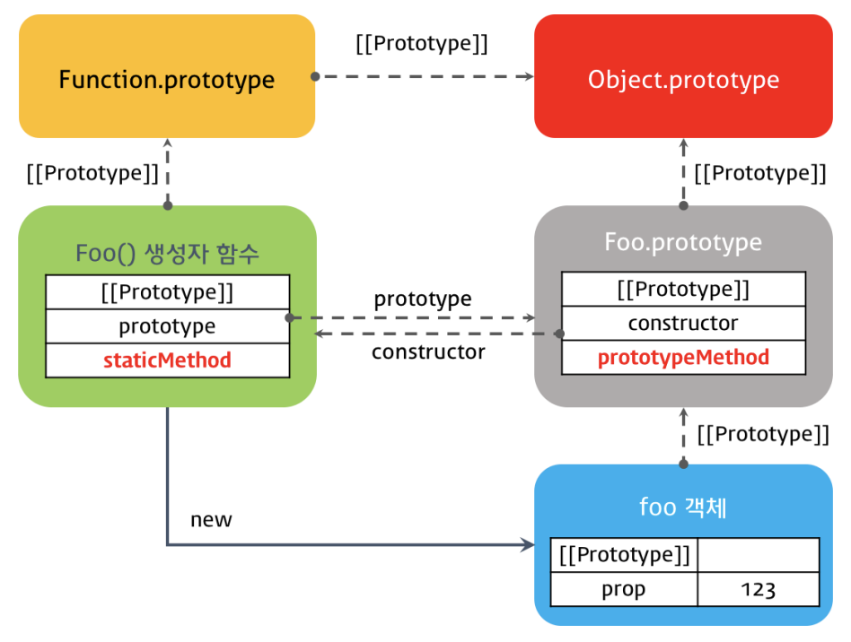

# class
## 정적 메서드 (static method)
static 키워드를 통해 정적 메서드를 선언할수 잇다.

```js
class Foo {
  constructor(prop) {
    this.prop = prop;      
  }
  static staticMethod() {
    return 'staticMethod';
  }
  prototypeMethod() {
    return 'prototypeMethod';
  }
}
 
const foo = new Foo(123);
 
console.log(Foo.staticMethod());
console.log(foo.staticMethod()); // Uncaught TypeError: foo.staticMethod is not a function
```



# 클래스 상속
- 상속을 통해 코드의 재사용을 높이는 개발방법이다.
- extends 키워드를 통해서 부모를 선언할 수 있다.
- JAVA처럼 super, 오버라이드가 가능하다.

```js
// 부모 Class
class Animal {
  constructor(weight) {
    this._weight = weight;
  }
 
  weight() {
    console.log(this._weight);
  }
 
  eat() { console.log('Animal eat.'); }
}
 
// 자식 Class
class Human extends Animal {
  constructor(weight, language) {
    super(weight);
    this._language = language;
  }
 
  // 부모 클래스의 eat 메소드를 오버라이드하였다
  eat() { console.log('Human eat.'); }
 
  speak() {
    console.log(`Koreans speak ${this._language}.`);
  }
}
 
const korean = new Human(70, 'Korean');
```

## super 
super 키워드로 부모클래스의 프로퍼티를 참조 할때, 생성자(constructor)를 호출할때 사용한다. 
자식클래스에서 생성할때 super호출하지 않으면 에러가 발생한다.
 
```js
class Child extends Parent {
  constructor(x, y, z) {
    // super 메소드는 자식 class의 constructor 내부에서 부모 클래스의 constructor(super-constructor)를 호출한다.
    super(x, y);
    this._z = z;
  }
..
..
..
  toString() {
    // super 키워드는 부모 클래스(Base Class)에 대한 참조이다. 부모 클래스의 프로퍼티 또는 메소드를 참조하기 위해 사용한다.
    return `${super.toString()}, ${this._z}`; // B
  }
}
```
 
# 모듈 (Module)
구현에 있어 구현부분을 캡슐화를 하고 외부에서 불러와 사용하여 재사용가능코드를 작성하는 방법이다. 일반적으로 파일 단위로 분리되어있으며, 필요시 파일경로로 로드를 하게된다.  
js에는 이런 모듈을 불러올수가 없는데, 이때문에 CommonJS와 AMD가 생기게된다.  
node.js의 경우 CommonJS 를 사용하고있다.  
ES6에서는 export, import 키워드가 있지만, 아직 브라우저에는 대부분 지원하지 않는다.  
때문에 webpack과 같은 모듈 번들러를 사용해야한다.
 
```js
// lib.js
const pi = Math.PI;
 
function square(x) {
  return x * x;
}
 
class Person {
  constructor(name) {
    this.name = name;
  }
}
 
// export 대상 
export { pi, square, Person };
// =============================
// main.js
import { pi, square, Person } from './lib';
console.log(pi);
 
// Or
import * as lib from './lib';
console.log(lib.pi);
```

# Babel, Webpack
## 바벨 (Babel)
``` 
$ npm init -y
$ npm install babel-cli --save-dev
$ npm install babel-preset-env --save-dev
```
 
```js
{
  "name": "babel-project",
  "version": "1.0.0",
  "devDependencies": {
    "babel-cli": "^6.26.0",
    "babel-preset-env": "^1.6.0"
  }
}
 
// ROOT/.babelrc 파일
{
  "presets": ["env"]
}
 
//package.json 설정 스크립트 추가
  "scripts": {
    "build": "babel src/js -w -d dist/js"
  },
```

### 바벨 옵션
-w  
파일 변경을 감지하여 자동으로 트랜스파일한다.(--watch 옵션의 축약형)


-d  
출력 파일이 저장될 폴더를 지정한다.(--out-dir 옵션의 축약형)
 
```
// 빌드
$ npm run build
 
// node 환경에서 
$ node dist/js/main
```
 
위 export나 import는 node환경에서는 구동되지만 브라우저에서는 구동이 안된다.
그러기에 webpack을 사용해야한다.
 
## 웹팩 (Webpack)
 
```js
// src/js/hello.js
export default 'Hello';
// ====================
// src/js/world.js
export default 'world';
// ====================
// src/js/entry.js
import hello from './hello';
import world from './world';
 
document.getElementById('demo').innerHTML = `${hello}, ${world}!`

// ================
```

``` 
$ npm install webpack --save-dev
$ npm install babel-loader --save-dev
```
 
```js
// package.json 
  "scripts": {
    "build": "webpack -w"
  },
 
//webpack.config.js
var path = require('path');
 
module.exports = {
  entry: {
    entry: './src/js/entry.js'
  },
  output: {
    filename: 'bundle.js',
    path: path.resolve(__dirname, 'dist/js')
  },
  module: {
    rules: [{
      test: /\.js$/,
      include: [
        path.resolve(__dirname, 'src/js')
      ],
      exclude: /node_modules/,
      use: {
        loader: 'babel-loader',
        options: {
          presets: ['env']
        }
      }
    }]
  },
  devtool: 'source-map'
};
```

```
$ npm run build
```

HTML bundle.js

HTML에서 babel + webpack으로 생성한 dundle.js를 사용하도록 한다.
 