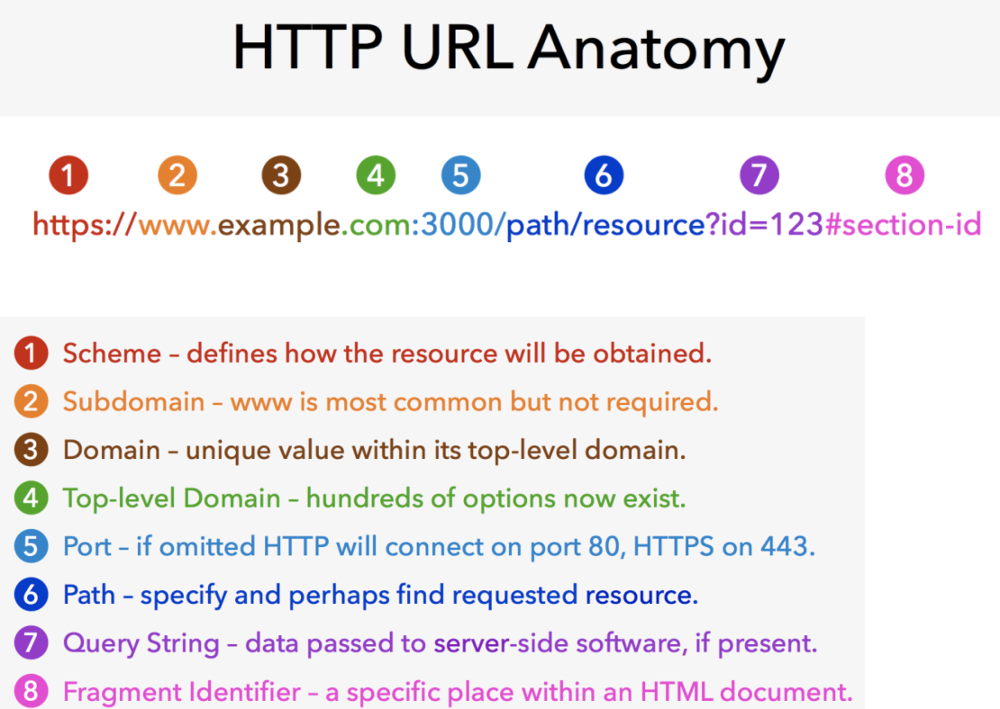

# HTTP
웹 브라우저와 웹 서버 간의 통신을 위해 개발된 통신규약.  
최근에는 REST API의 부상와 함께 다른 용도로도 널리 사용됨
- 모바일 앱 - 서버 간 통신
- 서버 - 서버 간 통신

80번 포트를 기본으로 사용

클라이언트의 요청(request)과 서버의 응답(response)으로 이루어짐
 
## 역사
- HTTP 초기버전 발표. 텍스트만 전송할 수 있는 극도로 단순한 프로토콜. 1990년대 초 인터넷 붐을 일으킴
- 여러 인터넷 서비스 업체들이 자체적으로 사용하던 HTTP 구현들을 모아 HTTP 1.0 발표
- 1.0의 문제를 해결하고 여러가지 기능을 추가한 HTTP 1.1을 발표. 지금까지 사용되고 있는 버전
 
# HTTPS
- HTTP over SSL
- HTTP 통신을 암호화해 주고받는 내용을 중간에서 가로챌 수 없도록 함
- 443번 포트를 기본으로 사용
 
# HTTP/2
- 구글의 SPDY 프로토콜을 기반으로 2015년에 확정된 새로운 HTTP 표준
- 속도 개선에 중점을 두고 개발됨
- 반드시 HTTPS를 사용해야 함
- 현재 전체 웹사이트 중 16% 이상이 사용중 (https://w3techs.com/technologies/details/ce-http2/all/all)
 
# HTTP구성요소
## Request, Response
- 웹 브라우저(또는 다른 클라이언트)는 웹 서버에 요청(request)를 보냄
- 그에 따라 서버는 클라이언트에 응답(response)를 보냄
- 웹 브라우저의 경우, HTML 문서 형태의 응답이 오면 해당 문서를 분석한 후, 문서에 포함된 모든 자원에 대한 요청을 각각 추가로 보냄 (이미지, 동영상, 오디오, CSS, JS, 폰트)
 
## Request 메소드
- HTTP 명세에는 8종류(https://developer.mozilla.org/ko/docs/Web/HTTP/Methods)가 등록되어 있고, 각각의 역할과 성질이 명시되어있다.
- 웹 브라우저는 특정 상황에서 특정 메소드로 요청을 보내도록 만들어져있다.
- Ajax와 같이 요청을 보내는 코드를 직접 짤 때는 요청 메소드를 개발자가 선택할수 있다.
- 자료의 본문을 요청하는 GET 메소드, 새로운 자료를 등록하는 POST 메소드를 가장 많이 쓰인다.
(서버 측면의 메소드성질)
- Safe : 요청이 서버에 영향을 주지 않아야 한다. (읽기전용, GET)
- Idempotent : 여러 번 같은 요청을 해도 한 번 요청한 것과 같아야 한다. 
네트워크가 불안정해도 안전하게 요청을 보낼수있도록 서버를 구성해야한다. (DELETE, GET)
- Cacheable : 응답을 클라이언트에 저장해두었다가 다음 번 요청 때 다시 쓸 수 있음
 
# URL

 
1) 스키마 : 자원 취득의 정의
2) 서브도메인 : 일반적으로 www이지만 필수는 아님
3) 도메인 : 최상위 도메인의 고유의 도메인명
4) 최상위도메인 : 최상위 도메인
5) 포트 : 서버의 포트번호. 기본은 80포트, https는 443포트 1~5번은 서버의 위치를 표시
6) 경로 : 요청한 리소스를 찾는다.
7) 쿼리문자 : 서버app에 전달되는 문자열
8) 브라우저 해시 : HTML문서내 특정위치
 
## Percent Encoding
URL은 기본적으로 ASCII문자(128자 영문자+특수문자+제어문자) 만 지원하는데, non-ASCII 문자를 위한 표현방법이 필요하다.

Percent encoding은 non-ASCII 문자를 위한 웹 표준 인코딩 방법이다.
 
> encodeURIComponent("한글")
"%ED%95%9C%EA%B8%80"
> decodeURIComponent("%ED%95%9C%EA%B8%80")
"한글"
 
## Request Target
## Response Status
응답의 성공, 실패 상태 메시지를 나타내며, 상태코드 + 상태메시지 형태로 응답. HTTP/1.1 200 OK
- 200 OK : 성공
- 201 Created : 자료가 정상적으로 생성됨
- 301 Moved Permanently(Redirection) : 자료가 완전히 다른곳으로 이동했음
- 302 Found(Redirection) : 자료가 일시적으로 다른곳에 있음
- 304 Not Modified (cache) : 클라이언트가 이미 가지고 있던 자료가 수정되지 않음.
- 400 Bad Request : 요청의 형태가 잘못됨
- 403 Forbidden : 요청한 자료에 접근할 권한이 없음
- 404 Not Found : 요청한 자료가 없음
- 500 Internal Server Error : 요청처리중 예상하지 못한 오류발생
- 503 Service Unavailable : 서버가 일시적으로 응답할수없음
 
상태코드 리스트 링크
 
 
## Header
- 요청과 응답에 대한 추가정보들을 표현하는데 사용된다.
- 인증, 캐싱, 쿠키, 보안, 프록시 등 웹표준에 정의된 기능들을 제어하는데 사용한다.
 
- Authorization : 요청의 인증 정보
- User-Agent : 요청 중인 클라이언트의 정보 (브라우저 정보)
- Location : 301, 302 응답에서 자료의 위치 
- Accept : 요청이 어떤 형태의 자료를 원하는지 나타냄
- Content-Type : 요청 혹은 응답이 어떤 형태의 자료인지 나타냄
 
### 내용협상 (Content Negotication)
클라이언트가 json형태로 요청을 한경우 헤더를 보고 서버가 그에 맞는 자료를 응답하는 절차.
