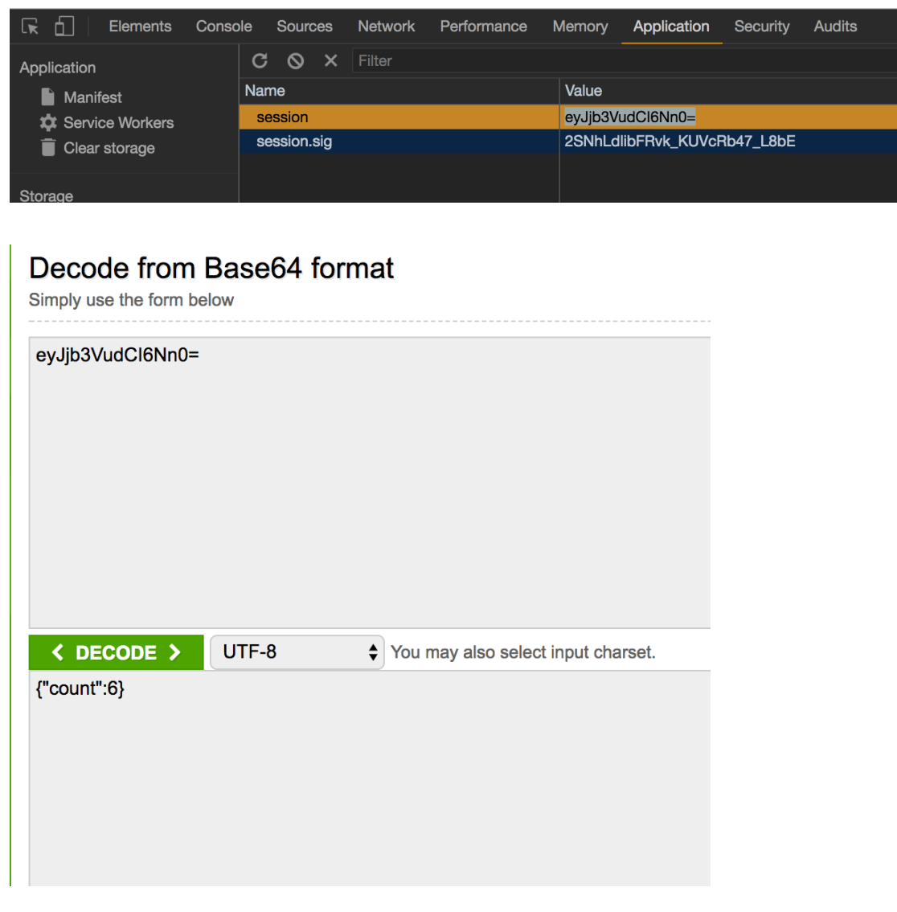

# Form
## HTML form
HTML의 form을 전송하면 기본적으로 percent 인코딩되어 전송된다.
- GET  
`GET /search?query=%EA%B0%9C&sort=latest HTTP/1.1`
- POST  
`POST /form HTTP/1.1 
Content-Type: application/x-www-form-urlencoded ... home=Cosby&favorite+flavor=flies
`
## multipart/form-data
- 기본적으로 폼은 파일을 올리는것이 불가능하다.
- [클라이언트 측] form 태그에 enctype="multipart/form-data" 속성을 적용하면 파일 업로드 가능
- [서버 측] body-parser 미들웨어는 multipart/form-data 형태의 요청을 지원하지 않음 (multer 필요)
 
 
## UUID (Universally unique identifier)
요소별로 식별자를 사용하기 위한 표현.  
424e19f5-f330-4be1-889f-4a9f7da75b69 와 같은 형식으로 표현한다.

 
표현할 수 있는 경우의 수가 넓다. (128bit = 2의 128제곱)
 
UUID 난수를 생성하는 표준적인 방법(UUID version 4)을 사용하면, 언제 어디서 UUID를 생성해도 정확히 같은 UUID가 생성될 수 있는 확률이 매우 작기 때문에 식별자로 활용할수있다.


# Express Middelware
- 함수. 함수내에 어떤 작업이든 가능하며,
- request객체, response객체, next 함수를 인자를 받음
- 다음 미들웨어를 동작시키기 위해 next 함수를 인자 없이 호출
- 등록된 순서대로 실행됨
 
## app.use
```js
//미들웨어를 앱 전체에서 동작하도록 주입한다.
app.use(helloMiddleware)
//특정 경로에서만 동작하도록 주입
app.use('/some-path', helloMiddleware)
//한 번에 여러 개 주입
app.use(middleware1, middleware2, middleware3, ...)
```
 
### 미들웨어로 할 수 있는것

로깅, HTTP body를 객체로 변환, 사용자 인증. 권한 관리

 
위와 같은일은 라우트 핸들러에서도 처리가 가능하지만, 코드재사용을 위해 기능중복 작성의 대체로 사용할수있다.
 
### 미들웨어 리스트
https://expressjs.com/ko/resources/middleware.html
https://www.npmjs.com/search?q=express+middleware
 
### 라우트 핸들러 vs 미들웨어
라우트핸들러도 미들웨어이며, next함수를 인자로 받아 넘길수도있다.
```js
app.get('/', (req, res, next) => { 
  if (!someCondition) { 
    next() // 요청을 처리를 하지 않고 다른 핸들러로 넘김 
  } 
  else { 
    res.send('hello') 
  } 
})
```
 
## 에러처리
https://www.bugsnag.com/, https://sentry.io/
위 서비스를 미들웨어로 주입하여 현황들을 파악할수 있는 서비스. 실서비스시 오류현황을 파악할수가 있다.
 
 
#### 클로저, 커링
미들웨어들은 Javascript의 Currying 커링으로 만들어져있다. 커링은 아래와 같이 인수와 함수와 결합되어 실행된다.
```js
function makeadder(x){
  return function(y){
    return x + y;
  }
}
 
add1 = makeadder(1) // x에 1 지정
add1(2) // 3
makeadder(3)(4) // 7
 
// es6 화살표함수
makeAdder2 = x => (y => x+y)
 
add5 = makeAdder2(1)
add5(2) // 3
makeAdder2(3)(4) // 7
```

### EditorConfig
협업간 코드 통일화
- http://editorconfig.org/
- https://github.com/airbnb/javascript/blob/master/.editorconfig
 
 
# 쿠키
- 클라이언트간 여러 요청에 걸친 정보유지
- 장바구니, 로그인 로그아웃 기능
 
## HTTP Cookie
- 서버가 응답을 통해 브라우저에 저장하는 이름+값 정보
- 브라우저는 쿠키를 저장하는 저장소를 가지고있다.
- 자료유효기간, 접근권한 등 다양한 옵션이 있다.
 

서버는 브라우저에 저장하고 싶은 정보를 응답과 같이 보낸다.   
`(Set-Cookie 헤더)
HTTP/1.1 200 OK
Set-Cookie: cookieName=cookieValue; Secure; Max-Age=60000
`

브라우저는 같은 서버에 요청이 일어날 때마다 해당 정보를 요청에 같이 실어서 서버에 보낸다 (Cookie 헤더)  
`
GET / HTTP/1.1
Cookie: cookieName=cookieValue; anotherName=anotherValue
`

## Express cookie
Express + Cookie
- 쿠키 읽기 - req.cookies  
  요청에 실려온 쿠키가 객체로 변환되어 req.cookies에 저장됨 (cookie-parser 미들웨어 필요)
- 쿠키 쓰기 - res.cookie(name, value)  
  쿠키의 생성 혹은 수정
 
## Javascript Cookie
JS로 쿠키를 읽고 쓸수있지만, 보안상 문제가 있어 거의 사용하지 않는다.  
JS에서 쿠키에 접근못하도록 httpOnly를 설정하는것이 좋다.
 
### 쿠키의 한계
- US-ASCII 밖에 저장하지 못한다 (보통 percent encoding을 사용)
- 4000 바이트 내외(영문 4000자, percent encoding 된 한글 444자 가량)밖에 저장하지 못함.
- 클라이언트 브라우저에 저장됨. 즉, 여러 브라우저에 걸쳐 공유되어야 하는 정보, 혹은 웹 브라우저가 아닌 클라이언트(모바일 앱)에 저장되어야 하는 정보를 다루기에는 부적절하다.
 
# 세션 (Session)
- 시작 조건과 종료 조건이 있는 시간, 또는 회기
- 정보 교환이 지속되는 시간, 또는 회기
 
## 일반적인 웹서비스의 세션구현
- 세션이 시작되면 세션이 시작되었다는것을 쿠키에 저장
- 세션에 대한 정보를 여러요청에 걸쳐서 지속하기 위해 정보를 어딘가에 저장
- 세션이 만료되면 만료된것을 쿠키에 반영
 
### 세션 스토어 
쿠키, 데이터베이스, 파일

기타 정보를 저장할 수 있는 곳 어디든,
서비스의 요구사항에 맞춰서 적절한 저장소를 선택하여 세션을 관리한다.
 
## Express + Session
- cookie-session  
  쿠키에 모든 정보를 저장하는 세션 스토어. 
  첫 방문시 무조건 세션 시작
- express-session
  쿠키에는 세션 식별자만 저장하고 실제 정보의 저장은 외부 저장소(데이터베이스 등)를 이용하는 세션 스토어. 외부 저장소에 대한 별도의 설정 필요
 
 
## 쿠키 세션
브라우저 쿠키에 세션이 저장되며 이는 base64로 변환되어 사용된다.

 

## 해시함수
일치여부 를 확인할수있는 코드 MD5, SHA
