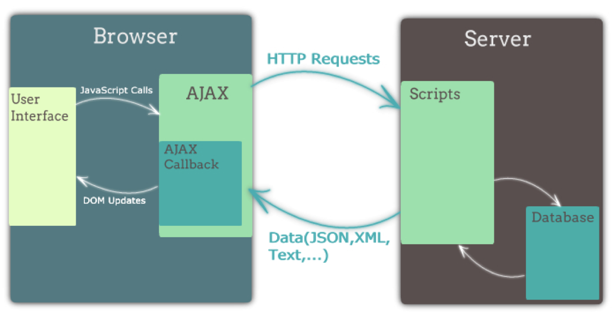
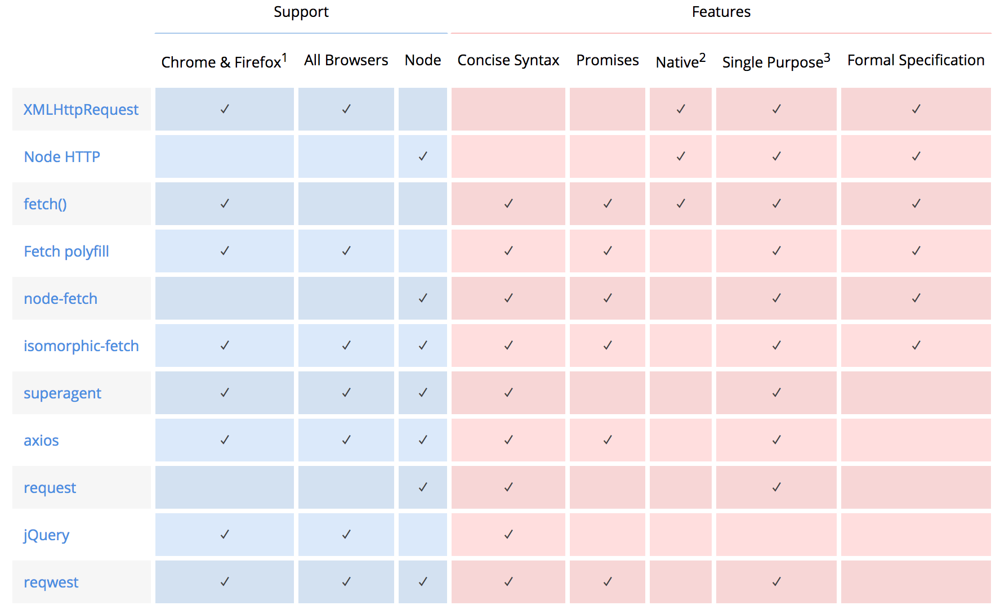
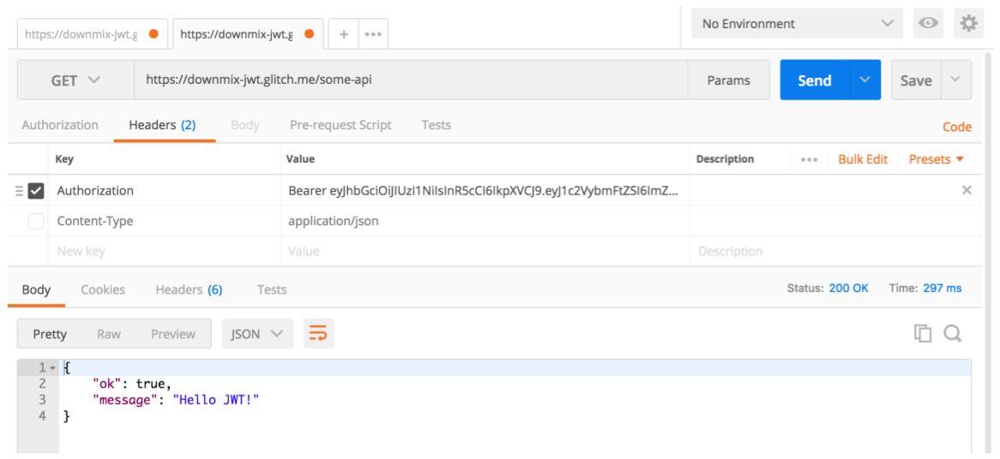

# Ajax
- 비동기적인 웹 어플리케이션의 제작을 위한 클라이언트 웹개발 기법
- 현재의 의미는 웹브라우저에서 XMLHttpRequest 혹은 fetch를 이용한 HTTP요청

 
## ajax특징
- 화면 전체를 다시 로드하지 않고도 내용을 갱신할 수 있어 더 나은 사용자 경험 제공
- 서버의 응답을 기다리는 동안에도 여전히 웹 어플리케이션을 사용 가능
- 필요한 자원만 서버에서 받아오게 되므로 트래픽이 줄어든다.
- 하지만 클라이언트 구현이 복잡하다.
 
 
## ajax 라이브러리 표

http://andrewhfarmer.com/ajax-libraries/
 
 
# Axios
- Promise based HTTP client
- 브라우저와 Node.js에서 모두 사용 가능
- XMLHttpRequest, fetch에 비해 사용하기 편하고 기능이 더 많다
 
 
# CORS
## Same-origin Policy
웹페이지에서 리소스를 가져올때 출처(도메인)가 같으면 안전, 출처가 다르면 안전하지 않다고 본다.

출처는 프로토콜 + 도메인 + 포트번호 결합된 출처이며, 모두 동일해야 한다.

기본적으로는 출처가 다르면 웹 보안정책에 따라 제어할수 없지만, Content-Security-Policy 헤더를 이용하면, 동일하지 않은 출처에 대한 리소스를 불러올지 말지 결정할 수 있다.

https://developers.google.com/web/fundamentals/security/csp/?hl=ko
 
## CORS (Cross-Origin Resource Sharing)
클라이언트 측 cross-origin 요청을 안전하게 보낼 수 있는 방법을 정한 표준.

cross-origin 요청에는 기본적으로 쿠키가 포함되지 않으나, XMLHttpRequest 혹은 fetch를 통해서 요청을 보낼 때 쿠키를 포함시키는 옵션을 줄 수 있고 이 때 CORS 요건이 더 엄격해진다.

기본적으로 
- 프론트엔드와 API 서버를 같은 도메인으로 제공한다.
- 불가피하게 둘을 다른 도메인으로 제공해야 한다면
  - CORS를 허용한다 (cors 미들웨어를 사용하면 간단함)
  - CORS를 허용했으므로 쿠키를 쓰지 않는다.
 
# Access Token, JWT
## 기존 쿠키의 단점
- 쿠키를 지원하는 클라이언트에서밖에 사용할 수 없음
- 적절히 관리되지 않은 쿠키는 보안에 취약하며, 관리를 하려고 해도 CORS 대응 어렵다.
 
## 토큰
다양한 인증 수단(전화번호, 공인인증서, 지문인식 등)의 인증 결과를 토큰이라는 하나의 수단으로 통일할 수 있다.  
쿠키를 사용하지 않음으로써 CORS 관련 문제를 회피할 수 있다.

하지만 매 요청에 토큰이 포함되게 되므로 적당히 짧은 길이를 유지해야 한다.

토큰 유출에 대한 대비책이 필요하다. (토큰에 유효기간을 두거나, 유출된 토큰을 강제로 무효화하는 등의 방법을 사용)  
쿠키와는 다르게, 클라이언트에서 직접 토큰을 저장하고 관리 해야 한다.
 
## Web Storage
- 브라우저에서 키-값 쌍을 저장할 수 있는 저장소
- 쿠키에 비해 사용하기 편리하고 저장 가능한 용량도 큼(10MB 가량)
- 브라우저 탭이 닫히면 내용이 삭제되는 sessionStorage, 
- 브라우저 탭이 닫혀도 내용이 유지되는 localStrage
 
### Web storage 주의사항
토큰을 localStorage에 저장하게 되면 자바스크립트로 토큰을 탈취할 수 있게 된다.

웹사이트에 악성 스크립트를 삽입하는 공격(XSS)에 노출되지 않도록 신경써야된다.

예로 `innerHtml` 를 사용하는것은 금물.

직접 DOM API를 사용하는 대신 EJS, React 같은 템플릿 언어를 사용하기만 해도 XSS에 대한 방어는 충분함
 
## JWT (JSON Web Token)
- 최근 널리 사용되고 있는 토큰 형식의 표준
- 토큰 안에 JSON 형식으로 정보를 저장함
- 보안을 위해 서명 또는 암호화를 사용할 수 있음

 

 
# 웹 개발의 보안
- innerHtml 사용 하지 말것 (템플릿 언어 사용)
- 쿠키 숙지후 사용
- https 사용
