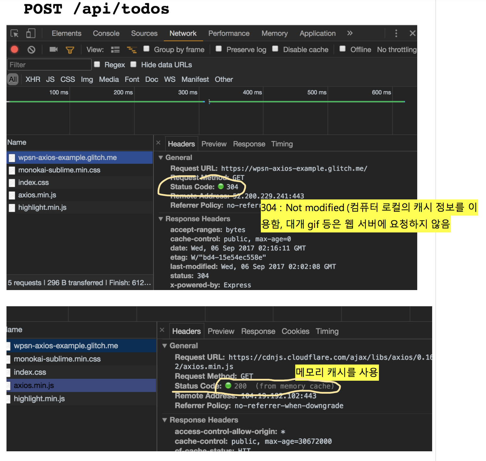
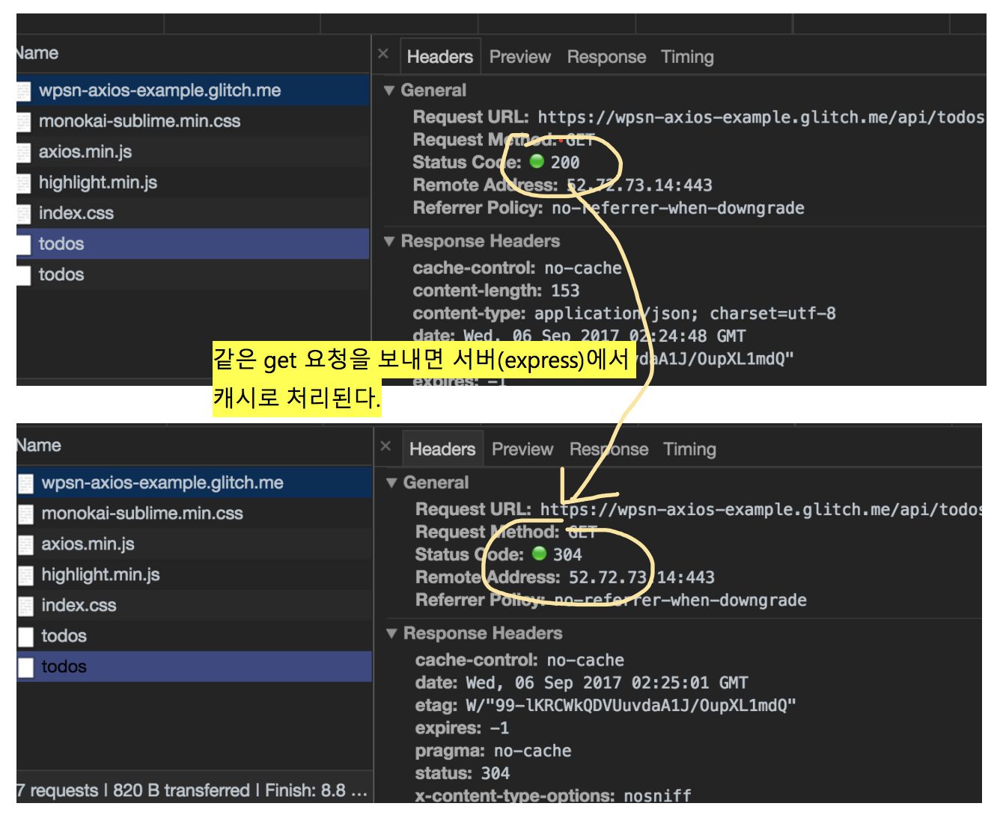
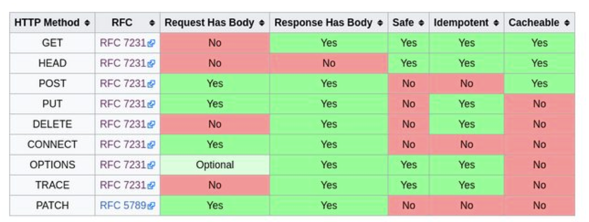
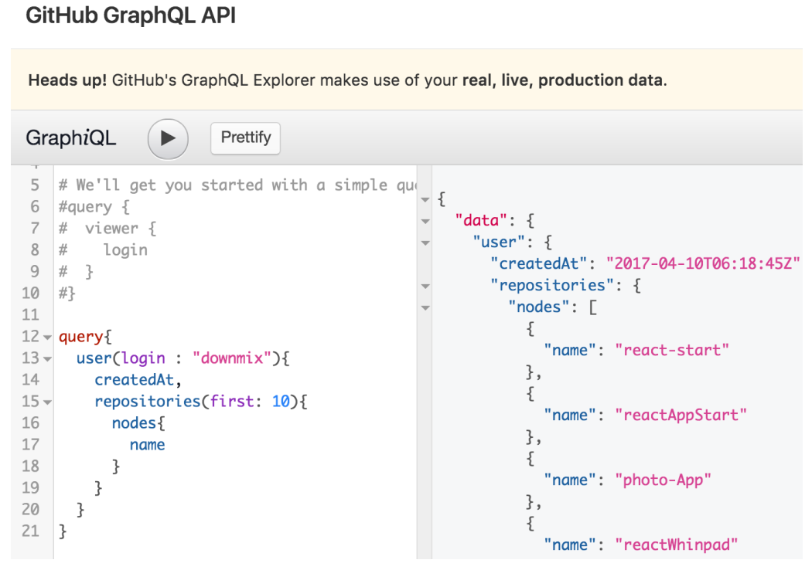

# 캐시 
데이터를 미리 복사해 놓는 임시 저장소, 혹은 그 임시 저장소에 데이터를 저장하는 행위.  
접근 속도를 개선하기 위해 따로 저장소를 두는 방법을 뜻한다.
 
# HTTP Cache
자원의 효율적 로딩을 위한 웹 표준
서버에서 가져온 자원(HTML, CSS, JS, 이미지, ...)을 가까운 곳(브라우저, 혹은 다른 서버)에 저장해놓고 재사용
캐시를 할 것인지 말 것인지, 어떻게 할 것인지를 결정하는 규칙이 복잡하고, 브라우저마다 조금씩 다르다.
 
## 캐시와 변경사항 반영
- Expiration (만료) : 정해진 시간이 지나면 캐시가 자동으로 삭제
- Validation (검증) : 서버에 요청을 보내서 캐시를 계속 사용할 수 있는지 확인
 
## 캐시 헤더
- Cache-Control : (요청, 응답) 캐시와 관련된 다양한 기능을 하는 지시자를 포함. no-cache, max-age가 많이 사용됨. no-cache, max-age=0 지시자는 캐시를 사용하지 않도록 하거나, 캐시를 아직도 쓸 수 있는지 검증하기 위해 사용됨
- ETag : (응답) 캐시의 검증을 위해 사용되는 자원의 식별자. 주로 자원의 해시값이 사용되나, 마지막으로 수정된 시각, 혹은 버전 넘버를 사용하기도 함
- Expires : (응답) 캐시를 만료시킬 시각을 서버에서 명시적으로 지정
- Last-Modified : (응답) 원래 자료가 마지막으로 수정된 시각
- If-None-Match : (요청) 검증을 위해 사용됨. 이전에 저장해두었던 자원의 ETag 값을 If-None-Match 헤더의 값으로 요청에 포함시켜서 보내면, 서버는 해당 경로에 있는 자원의 ETag와 비교해보고 자원의 전송 여부를 결정
- If-Modified-Since : (요청) 검증을 위해 사용됨. 이전에 저장해두었던 자원의 Last-Modified 값을 If-Modified-Since 헤더의 값으로 요청에 포함시켜서 보내면, 서버는 해당 경로에 있는 자원의 Last-Modified와 비교해보고 자원의 전송 여부를 결정
 
 
## 캐시 브라우저 파악

위와 같이 서버에서 자동적으로 캐시를 사용하기도 하는데, 개발시 의도하지 않는 결과가 있을수도 있으니 브라우저의 강제 새로고침와 같은 기능을 사용해야한다.
 
## 메소드별 캐시주기

POST 메소드는 Cacheable 범주에 포함되기는 하지만, 특별한 조건을 만족시켜야 하며 실무에서는 POST chace가 거의 사용안한다.  
브라우저와 Express는 이미 캐시를 잘 활용하도록 만들어져 있습니다.

일단 별다른 추가작업 없이도 편하게 캐시 기능을 사용할 수 있지만, 우리가 원하는대로 캐시가 동작하지 않을 때 그 원인을 파악하기 위해 캐시 관련 헤더는 숙지해두는 것이 좋습니다. 그리고 HTTP method를 용도에 맞게사용하는 것도 중요합니다.
 
 
# REST API 단점
각각 자원마다 경로가 따로 분리되어있다. 여러자원을 동시에 필요하다면 요청도 여러번 보내야한다.

자원의 필요한 속성만 가져올수없음. 작은 일부만 필요하더라도 전체속성을 가져와야 하는 용량적으로 비효율적일수 있다.
 
# GraphQL
facebook에서 2015년에 공개한 데이터 질의언어
REST API를 대체하기위해 만들어졌다.  
클라이언트에서 필요한 데이터의 구조를 GraphQL 언어로 정의한 후 질의할 수 있고, 서버는 그에 맞게 구조화된 데이터를 응답한다.  
서버에서는 GraphQL 질의를 해석하기 위해 별도의 해석기가 필요하며, 여러 언어의 구현체(http://graphql.org/code/) 제공하고 있다.

github GraphQL : https://developer.github.com/v4/explorer/

 
# SPA
클라이언트와 서버간 HTML파일로 리로드 하며 웹을 구성하는 고전적인 방법에서
클라이언트 단에서 필요한 부분만 반영하는 방식. 웹페이지가 아닌 프로그램처럼 동작한다.