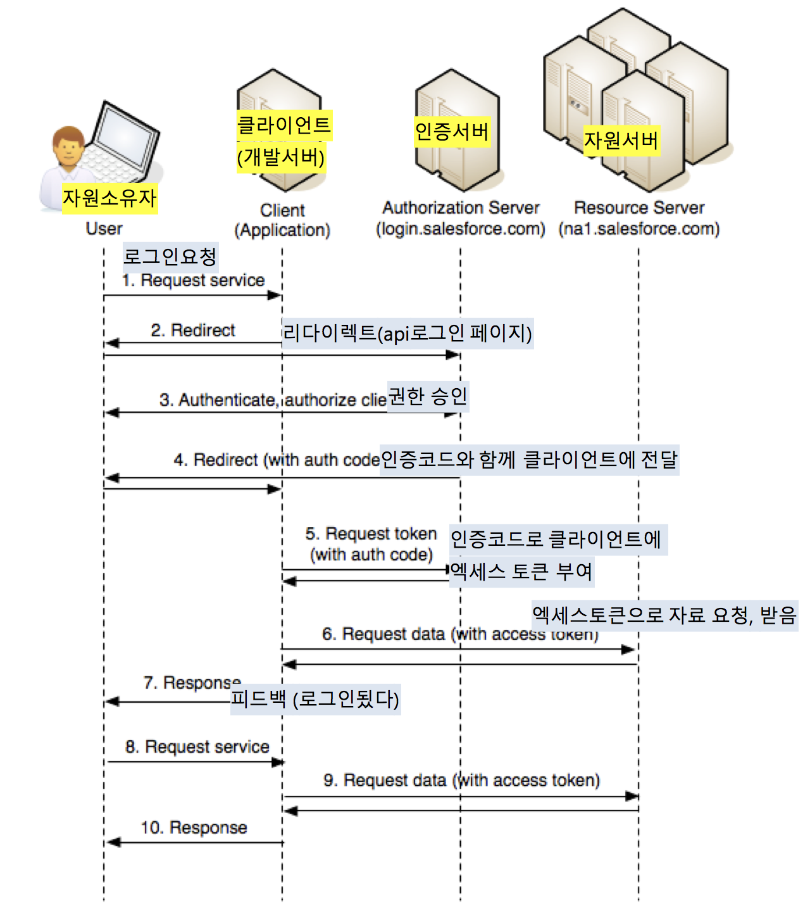

# Passport
다양한 인증 수단을 지원할 수 있도록 추상화된 인증 미들웨어.

최근 외부서비스를 통한(SNS, 포털) 인증을 많이 시도하기 때문에 기본적으로 각각 인증서비스마다 코드를 따로 작성해야 한다.

Passport를 사용하면 어떤 인증 방식을 사용하건 간에 통일된 방식으로 인증 절차를 정의할 수 있습니다. Passport가 강제하는 방식으로 인증을 하게 되면, 다양한 인증 수단을 활용하기 위해 필요한 구현 비용이 많이 줄게된다.


## 적용
Passport는 인증 절차를 정의하기 위해 strategy라는 개념을 사용하는데, 특정 인증 방식에 대해 정해진 방식대로 strategy를 구현하기만 하면, express와 같은 웹 서버와 쉽게 연동이 가능하다.
http://passportjs.org/

```js 
// passport 관련 미들웨어 삽입
app.use(passport.initialize())
app.use(passport.session()) //세션을 사용하지 않는다면 생략한다.
```
 
Passport는 인증 절차를 정의하기 위해 strategy라는 개념을 사용한다. 특정 인증 방식에 대해 정해진 방식대로 strategy를 구현하기만 하면, express와 같은 웹 서버와 쉽게 연동된다.

이런 각 서비스별로 strategy가 준비되어있는데, 각각 구현방법이 조금씩 다르다.
 
```js
// passport-local을 통해 생성한 라우트 핸들러
app.post('/login', passport.authenticate(('local'), {
  successRedirect: '/', // 인증 성공 시 리다이렉트시킬 경로
  failureRedirect: '/login', // 인증 실패 시 리다이렉트시킬 경로
  failureFlash: '아이디 혹은 패스워드가 잘못되었습니다.' // 인증 실패 시 표시할 메시지
}))
```

## req.login, logout

세션을 이용한 인증을 할 때, 일반적으로 user 객체를 대표하는 특정 속성(id 혹은 username)을 세션에 저장하는 작업을 합니다. 또한 세션에 들어있는 유저 정보를 통해 데이터베이스에서 user 객체를 얻어오는 작업도 합니다. 이 또한 각각 직렬화, 역직렬화라고 할 수 있을 것입니다.

passport는 사용 중인 인증 방식에 관계없이 통일된 방식으로 직렬화/역직렬화를 하도록 강제합니다. 이를 따르면 여러 인증 방식을 사용하더라도 문제 없이 세션에 인증 정보를 저장하고 세션으로부터 인증 정보를 추출할 수 있습니다.

req.login(user)는 user 객체를 직렬화한 뒤 세션에 저장해서, 해당 세션을 로그인시키는 메소드이다. passport.authenticate메소드가 생성한 라우트 핸들러를 사용한다면, 이 라우트 핸들러 안에서 req.login 메소드가 호출되기 때문에 따로 로그인을 시켜줄 필요는 없습니다. 주로 req.login는 회원가입 이후에 자동으로 로그인을 시켜주려는 목적으로 사용된다.

```js
app.post('/register', (req, res, next) => {
  query.createUser(req.body.username, req.body.password)
    .then(user => {
      // 회원 가입 시 자동으로 로그인 시키고 리다이렉트
      req.login(user, err => {
        if (err) {
          next(err)
        } else {
          res.redirect('/')
        }
      })
    })
    .catch(util.flashError(req, res))
})
```

req.logout 메소드는 현재 세션에 들어있는 인증 정보를 지우고 로그아웃을 시키는 메소드
```js 
app.post('/logout', (req, res) => {
  // passport가 제공하는 `req.logout` 메소드
  req.logout()
  res.redirect('/login')
})
```

# OAuth 인증
사용자 인증방식을 표준화 한것.
OAuth를 사용하면 사용자의 아이디와 암호가 노출되지 않도록 하면서도 애플리케이션에 API 접근 권한을 안전하게 위임할 수 있다.


- 자원소유자 : OAuth를 통해 보호되고 있는 자원을 소유하고 있는 자원의 실제 소유자입니다. 웹 애플리케이션의 사용자입니다.
- 자원 서버: 사용자 소유의 자원을 제공하는 서버. API 서버라고 봐도 무방합니다.
- 인증 서버: 소규모 서비스의 경우 자원 서버와 같은 서버에 위치해있는 경우가 많습니다.
- 클라이언트: OAuth를 통해 보호되고 있는 자원에 사용자 대신 접근하려고 하는 주체를 말합니다. 보통 자원 서버가 제공하는 API를 사용하려고 하는 웹 애플리케이션 서버를 가리킨다.